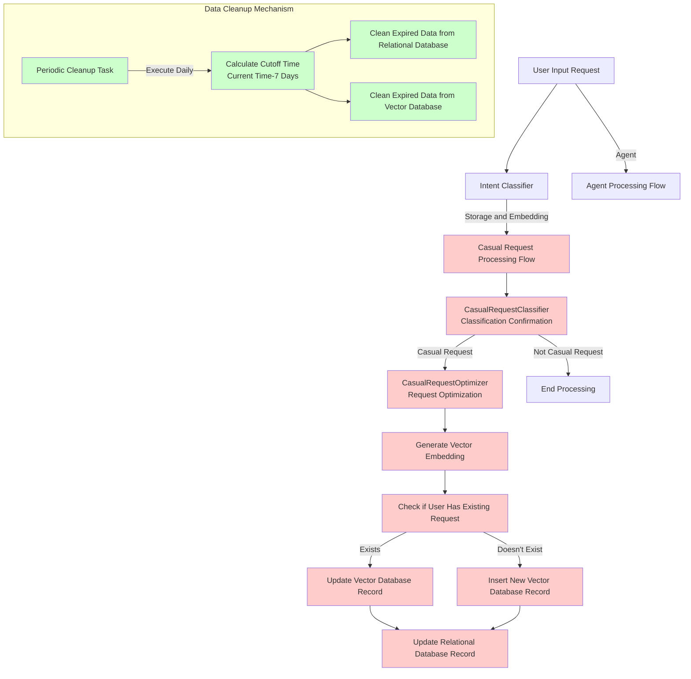
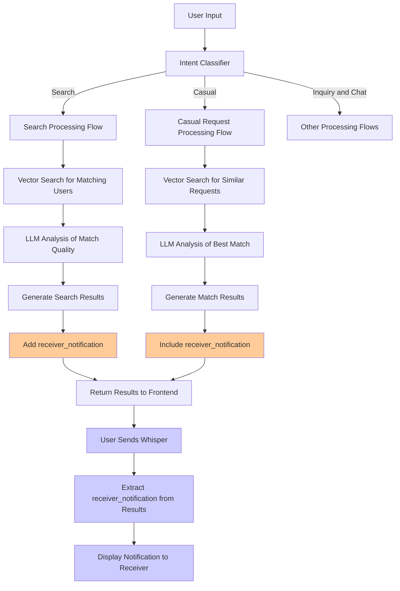

# Casual Request Integration Guide

This document provides detailed guidelines for integrating casual request functionality into the existing intelligent search agent system. The guide contains necessary data structures, function modifications, and prompt templates to ensure smooth feature implementation.

## Table of Contents

1. [Functionality Overview](#functionality-overview)
2. [Flowcharts](#flowcharts)
3. [Data Storage and Vector Embedding](#data-storage-and-vector-embedding)
4. [Data Cleanup Mechanism](#data-cleanup-mechanism)
5. [Agent Classifier Modifications](#agent-classifier-modifications)
6. [Processor Modifications](#processor-modifications)
7. [Search Notification Implementation](#search-notification-implementation)
8. [Key Component Implementation](#key-component-implementation)


## Functionality Overview

This integration will add casual request processing capabilities to the existing search system:

1. The system will automatically classify whether a user query is a casual request
2. Casual requests will be stored in dedicated database tables and vector database
3. Only the latest request from each user will be kept
4. Data without any new writes for a week will be automatically cleaned up
5. Both search results and casual request results will contain receiver notifications in a unified format
6. Notifications and match reasons will be sent to the frontend for display and user whisper functionality

### Comparison with Search Functionality

**Similarities**:
- Uses the same intent classification entry point and routing architecture
- Both employ vector search technology for matching
- Results both include a `receiver_notification` field for frontend display
- Both use LLM for result optimization and match analysis
- Unified result return format for easy frontend processing

**Differences**:
- **Vector Type**: Casual requests only use dense vectors (BGE) for matching, not sparse vectors
- **Search Strategy**: Casual requests don't have complex search expansion strategies or fallback mechanisms
- **Storage Characteristic**: Only the latest casual request per user is kept (using UNIQUE constraint)
- **Matching Logic**: Search matches talent based on skills and conditions, casual requests match users based on activity interests
- **Data Cleanup**: Casual requests have specific expired data cleanup mechanisms

## Flowcharts

### Data Storage and Maintenance Logic Flowchart



### Search Display Logic Flowchart



These flowcharts clearly illustrate the casual request functionality processing flow and its integration with the existing search system. They particularly highlight the key elements of data storage, maintenance, and display logic, as well as the interaction between various components. Development teams can reference these diagrams to understand the entire implementation process.

## Data Storage and Vector Embedding

### 1. Database Table Structure

A dedicated database table needs to be created to store casual requests, with each user keeping only their latest record:

```sql
CREATE TABLE IF NOT EXISTS casual_requests (
    id SERIAL PRIMARY KEY,
    user_id VARCHAR(50) NOT NULL UNIQUE,  -- User ID, set as UNIQUE to ensure only one record per person
    query TEXT NOT NULL,                   -- Original request text
    optimized_query TEXT NOT NULL,         -- Optimized request text
    is_active BOOLEAN DEFAULT TRUE,        -- Whether the request is active
    location VARCHAR(100),                 -- Optional location information
    preferences JSONB,                     -- User preferences
    created_at TIMESTAMP DEFAULT CURRENT_TIMESTAMP,
    updated_at TIMESTAMP DEFAULT CURRENT_TIMESTAMP,
    last_activity_at TIMESTAMP DEFAULT CURRENT_TIMESTAMP  -- Used for cleaning up expired data
);

-- Create indices
CREATE INDEX idx_casual_requests_user_id ON casual_requests(user_id);
CREATE INDEX idx_casual_requests_last_activity ON casual_requests(last_activity_at);
```

### 2. Vector Database Storage Structure

Create a dedicated collection in the vector database for casual requests. **Note**: Unlike search, casual requests only use dense vectors (BGE model) for matching, not sparse vectors, which simplifies implementation and query processes:

```python
def initialize_casual_request_collection(client: QdrantClient, collection_name: str = "casual_requests"):
    """Initialize vector collection for casual requests"""
    # Check if collection exists
    collections = client.get_collections().collections
    collection_names = [collection.name for collection in collections]
    
    # Create collection if it doesn't exist
    if collection_name not in collection_names:
        # Create collection, only using dense vectors
        client.create_collection(
            collection_name=collection_name,
            vectors_config=models.VectorParams(
                size=1024,  # Dimension based on the dense vector model used
                distance=models.Distance.COSINE
            )
        )
        
        # Create payload field indices for storage and filtering
        client.create_payload_index(
            collection_name=collection_name,
            field_name="user_id",
            field_schema="keyword"  # Set as keyword type
        )
        
        client.create_payload_index(
            collection_name=collection_name,
            field_name="last_activity_at",
            field_schema="float"  # Store timestamp
        )
        
        print(f"Collection '{collection_name}' created successfully.")
    else:
        print(f"Collection '{collection_name}' already exists.")
```

> **Performance Optimization Suggestion**: Consider using the vector database's BGE embedding feature directly (such as Qdrant's built-in vectorization service) instead of calculating embedding vectors in the application server. This can significantly reduce the computational load on the backend server. Simply configure the vector database to use the same BGE model, and then send the raw text rather than vectors to the database.

### 3. Request Processing and Storage Flow

When a user makes a query, integrate logic to save casual requests into the processing flow:

```python
async def process_and_store_casual_request(
    user_input: str,
    user_id: str,
    classifier: CasualRequestClassifier,
    optimizer: CasualRequestOptimizer,
    qdrant_client: QdrantClient,
    embedding_model: SentenceTransformer,
    collection_name: str = "casual_requests",
    db_conn = None  # Database connection object
) -> Dict:
    """Process and store casual request"""
    # 1. Use classifier to determine if it's a casual request
    classification = classifier.is_casual_request(user_input)
    
    if not classification.get("is_casual", False):
        # If not a casual request, return directly
        return {
            "is_stored": False,
            "reason": "Not a casual request"
        }
    
    # 2. Optimize request text
    optimization_result = optimizer.optimize_query(user_input)
    optimized_query = optimization_result.get("optimized_query", user_input)
    
    # 3. Generate vector embedding
    vector = embedding_model.encode(optimized_query, normalize_embeddings=True).tolist()
    current_timestamp = time.time()
    
    # 4. Update or insert into vector database
    point_id = f"casual_request_{user_id}"  # Use user ID as unique identifier
    
    try:
        # Check if already exists
        search_result = qdrant_client.search(
            collection_name=collection_name,
            query_filter=models.Filter(
                must=[
                    models.FieldCondition(
                        key="user_id",
                        match=models.MatchValue(value=user_id)
                    )
                ]
            ),
            limit=1
        )
        
        if search_result and len(search_result) > 0:
            # Update if exists
            qdrant_client.update_vectors(
                collection_name=collection_name,
                points=[
                    models.PointVectors(
                        id=search_result[0].id,
                        vector=vector
                    )
                ]
            )
            
            # Update payload
            qdrant_client.update_payload(
                collection_name=collection_name,
                points=[search_result[0].id],
                payload={
                    "user_id": user_id,
                    "query": user_input,
                    "optimized_query": optimized_query,
                    "last_activity_at": current_timestamp
                }
            )
        else:
            # Insert if doesn't exist
            qdrant_client.upsert(
                collection_name=collection_name,
                points=[
                    models.PointStruct(
                        id=point_id,
                        vector=vector,
                        payload={
                            "user_id": user_id,
                            "query": user_input,
                            "optimized_query": optimized_query,
                            "last_activity_at": current_timestamp
                        }
                    )
                ]
            )
    except Exception as e:
        print(f"Error storing vector: {e}")
        # Continue to save to database, even if vector storage fails
    
    # 5. Update or insert into relational database
    if db_conn:
        try:
            with db_conn.cursor() as cursor:
                # Try to insert, update if exists
                cursor.execute("""
                    INSERT INTO casual_requests (user_id, query, optimized_query, updated_at, last_activity_at)
                    VALUES (%s, %s, %s, NOW(), NOW())
                    ON CONFLICT (user_id) 
                    DO UPDATE SET 
                        query = EXCLUDED.query, 
                        optimized_query = EXCLUDED.optimized_query,
                        updated_at = NOW(),
                        last_activity_at = NOW()
                """, (user_id, user_input, optimized_query))
                db_conn.commit()
        except Exception as e:
            print(f"Error storing to database: {e}")
            db_conn.rollback()
    
    return {
        "is_stored": True,
        "query": user_input,
        "optimized_query": optimized_query
    }
```

This function should be called in the user query processing flow to ensure that only the latest casual request is retained for each user.

## Data Cleanup Mechanism

To ensure data timeliness, a cleanup mechanism needs to be implemented to automatically delete casual request data that has had no new writes for a week. This can be implemented through scheduled tasks or triggers.

### 1. Database Cleanup Function

```python
def clean_expired_casual_requests(db_conn, days_threshold: int = 7):
    """Clean casual request data that has been inactive beyond the specified number of days"""
    try:
        with db_conn.cursor() as cursor:
            # Calculate cutoff time (current time minus threshold days)
            cursor.execute("""
                DELETE FROM casual_requests
                WHERE last_activity_at < NOW() - INTERVAL %s DAY
            """, (days_threshold,))
            
            deleted_count = cursor.rowcount
            db_conn.commit()
            
            print(f"Cleaned {deleted_count} expired casual requests from database")
            return deleted_count
    except Exception as e:
        print(f"Error cleaning expired casual requests from database: {e}")
        db_conn.rollback()
        return 0
```

### 2. Vector Database Cleanup Function

```python
def clean_expired_casual_request_vectors(
    qdrant_client: QdrantClient,
    collection_name: str = "casual_requests",
    days_threshold: int = 7
):
    """Clean casual requests in vector database that have been inactive beyond the specified number of days"""
    try:
        # Calculate cutoff timestamp (seconds)
        cutoff_timestamp = time.time() - (days_threshold * 24 * 60 * 60)
        
        # Create filter condition
        expired_filter = models.Filter(
            must=[
                models.FieldCondition(
                    key="last_activity_at",
                    range=models.Range(
                        lt=cutoff_timestamp  # Less than cutoff time
                    )
                )
            ]
        )
        
        # Search for records to be deleted
        expired_points = qdrant_client.scroll(
            collection_name=collection_name,
            scroll_filter=expired_filter,
            limit=1000,  # Process up to 1000 at a time
            with_payload=False,
            with_vectors=False
        )
        
        # Extract IDs
        point_ids = [point.id for point in expired_points[0]]
        
        if point_ids:
            # Delete expired records
            qdrant_client.delete(
                collection_name=collection_name,
                points_selector=models.PointIdsList(
                    points=point_ids
                )
            )
            
            print(f"Cleaned {len(point_ids)} expired casual requests from vector database")
            return len(point_ids)
        else:
            print("No expired casual requests found in vector database")
            return 0
    except Exception as e:
        print(f"Error cleaning expired casual requests from vector database: {e}")
        return 0
```

### 3. Setup Scheduled Cleanup Tasks

You can use the system's cron jobs or an in-application scheduler to run cleanup tasks periodically:

```python
# Using APScheduler as an example
from apscheduler.schedulers.background import BackgroundScheduler

def setup_cleaning_schedule(db_conn, qdrant_client, collection_name="casual_requests"):
    """Setup periodic cleanup tasks"""
    scheduler = BackgroundScheduler()
    
    # Add database cleanup task, execute at 3:00 AM daily
    scheduler.add_job(
        clean_expired_casual_requests,
        'cron',
        hour=3,
        minute=0,
        args=[db_conn]
    )
    
    # Add vector database cleanup task, execute at 3:30 AM daily
    scheduler.add_job(
        clean_expired_casual_request_vectors,
        'cron',
        hour=3,
        minute=30,
        args=[qdrant_client, collection_name]
    )
    
    # Start scheduler
    scheduler.start()
    
    print("Cleaning schedule has been set up")
    return scheduler
```

These cleanup functions and scheduled tasks should be set up when the application starts to ensure regular cleanup of expired data.

## Agent Classifier Modifications

To support casual request processing, the existing Agent classifier needs to be modified to identify and correctly classify these types of requests. The main modifications involve the classifier prompts used in the `analyze_user_intent` method.

### 1. Modify Classifier Prompt

In the `analyze_user_intent` method of the `SearchAgent` class, modify the system_prompt to support the casual request type:

```python
def analyze_user_intent(self, user_input: str, referenced_user: Dict = None, current_user: Dict = None) -> Dict:
    """Analyze user input intent"""
    
    self.stats["llm_calls"] += 1
    
    # Build prompt based on user input
    system_prompt = """
    You are an advanced intent classification expert responsible for accurately identifying the true intent of user input. Your task is to classify the user input into one of four core intent types: search, inquiry, chat, casual.

    Intent type definitions:

    1. **Search Intent (search)**:
    - Core features: Looking for talent matching specific skills and conditions
    - Key indicators: Emphasis on professional skills, experience, background
    - Typical expressions: "Find a Python engineer", "Help me find a designer", "Need a UI frontend developer"
    
    2. **Inquiry Intent (inquiry)**:
    - Core features: Asking about specific user information or capabilities
    - Key indicators: Has a clear inquiry subject, questions about a specific person
    - Typical expressions: "How is this person?", "Are they suitable for our project?"

    3. **Chat Intent (chat)**:
    - Core features: General conversation, feature consultation, no clear search target
    - Key indicators: Greetings, system function inquiries, general conversation
    - Typical expressions: "Hello", "How to use the system?", "How's the weather today"

    4. **Casual Request Intent (casual)**:
    - Core features: Social activity invitations, looking for activity partners, non-work related
    - Key indicators: Focus on activities rather than skills, emphasis on social aspects and hobbies
    - Typical expressions: "Anyone want to go hiking this weekend?", "Looking for someone to have coffee with", "Who wants to go to the movies together"

    Classification process:
    1. Analyze the semantic content and structure of user input
    2. Consider if there is referenced user information
    3. Determine the most fitting intent type
    4. Output the intent type and confidence score (0.0-1.0)

    Return format must be a JSON object with the following fields:
    {
        "intent": "search|inquiry|chat|casual",
        "confidence": 0.0-1.0,
        "reasoning": "Brief explanation of why this intent type was chosen"
    }
    
    Do not use nested structures, do not add extra fields, do not use comments. Return only a JSON object that conforms to the above format.
    """
    
    # Build user input and context
    user_content = f"Please analyze this user input: \"{user_input}\"\n"
    
    # Add referenced user to context if available
    if referenced_user:
        user_content += f"\nReferenced user information: {json.dumps(referenced_user, ensure_ascii=False)}\n"
    
    # Add current user information to context if available
    if current_user:
        user_content += f"\nCurrent user information: {json.dumps(current_user, ensure_ascii=False)}\n"
    
    # Call GLM model for intent classification
    # Rest of the code remains unchanged...
```

This modified prompt clearly includes casual requests as the fourth intent type and provides specific recognition criteria and examples.

### 2. Classifier Test Cases

To verify the effectiveness of the classifier, add the following test cases:

```python
test_queries = [
    "Help me find a Python engineer",                  # search
    "What about this person's skills?",                # inquiry
    "Hello, how's the weather today?",                 # chat
    "Anyone want to go to the movies this weekend?",   # casual
    "Looking for someone to have coffee and chat",     # casual
    "Anyone want to go hiking this weekend? Preferably with experience",   # casual
    "Looking for an experienced project manager familiar with agile development",       # search
    "How does this designer's portfolio look?",         # inquiry
    "How do I add a new user to the system?",          # chat
]

for query in test_queries:
    intent_result = agent.analyze_user_intent(user_input=query)
    print(f"Query: '{query}' => Intent: {intent_result.get('intent')} (Confidence: {intent_result.get('confidence'):.2f})")
```

This test will help confirm that the classifier can accurately distinguish between different types of user intents, especially correctly identifying casual requests.

## Processor Modifications

After adding classifier support for casual requests, the processor part needs to be modified to properly handle requests identified as "casual" type. The main modifications involve the routing function and processing flow.

### 1. Modify Routing Function

Add a branch for handling casual type in the `route_to_processor` method of the `SearchAgent` class:

```python
async def route_to_processor(
    self,
    intent_result: Dict,
    user_input: str,
    current_user: Dict = None,
    referenced_ids: List[str] = None,
    viewed_user_ids: List[str] = None,
    language_code: str = "zh"
) -> Dict:
    """Route to appropriate processor based on intent analysis result"""
    
    # Get intent and confidence
    intent = intent_result.get("intent", "unknown")
    confidence = intent_result.get("confidence", 0.0)
    
    print(f"🎯 Route to processor: {intent} (confidence: {confidence:.2f})")
    
    if intent == "search":
        # Process search intent
        return await self.process_search(
            user_input=user_input,
            current_user=current_user,
            referenced_ids=referenced_ids,
            viewed_user_ids=viewed_user_ids,
            language_code=language_code
        )
    elif intent == "inquiry":
        # Process inquiry intent
        if not referenced_ids or len(referenced_ids) == 0:
            # Handle case when no user is referenced
            return {
                "type": "error_response",
                "error": "No user referenced for inquiry",
                "suggestion": "Please specify which user you are asking about."
            }
        
        # Get referenced user information
        referenced_user = await self._get_user_info(referenced_ids[0])
        
        # Process inquiry request
        return self.process_inquiry(
            user_input=user_input,
            referenced_user=referenced_user,
            current_user=current_user,
            language_code=language_code
        )
    elif intent == "chat":
        # Process chat intent
        return self.process_chat(
            user_input=user_input,
            current_user=current_user,
            language_code=language_code
        )
    elif intent == "casual":
        # Process casual request intent
        return await self.process_casual_request(
            user_input=user_input,
            current_user=current_user,
            language_code=language_code
        )
    else:
        # Process unknown intent
        return {
            "type": "error_response",
            "error": f"Unknown intent: {intent}",
            "suggestion": "Please try rephrasing your request."
        }
```

### 2. Implement Casual Request Processing Method

Add the `process_casual_request` method to the `SearchAgent` class:

```python
async def process_casual_request(
    self,
    user_input: str,
    current_user: Dict = None,
    language_code: str = "zh"
) -> Dict:
    """Process casual request"""
    
    # Start timing
    start_time = time.time()
    
    # Get user ID
    user_id = current_user.get('user_id', 'unknown') if current_user else 'unknown'
    
    # 1. Store user's casual request
    if user_id != 'unknown':
        await process_and_store_casual_request(
            user_input=user_input,
            user_id=user_id,
            classifier=self.casual_classifier,
            optimizer=self.casual_optimizer,
            qdrant_client=self.qdrant_client,
            embedding_model=self._dense_model,
            collection_name=self.casual_collection_name,
            db_conn=self.db_conn
        )
    
    # 2. Classify and optimize the request
    classification = self.casual_classifier.is_casual_request(user_input)
    optimization = self.casual_optimizer.optimize_query(user_input)
    
    # 3. Search for similar casual requests
    casual_results = await self.casual_search_engine.search_casual_requests(
        query_text=optimization.get("optimized_query", user_input),
        limit=10
    )
    print(f"🔍 Vector search found {len(casual_results)} casual requests")
    
    # 4. Find best match
    match_result = await self.casual_search_engine.find_best_match(
        casual_results=casual_results,
        query_text=user_input,
        current_user=current_user,
        language_code=language_code
    )
    
    # End timing
    elapsed_time = time.time() - start_time
    
    # Build return result
    result = {
        "type": "casual_request",
        "classification": classification,
        "optimization": optimization,
        "best_match": match_result,
        "processing_time": elapsed_time
    }
    
    return result
```

### 3. Update `intelligent_conversation` Method

In the main entry function `intelligent_conversation`, ensure casual type results are handled correctly:

```python
async def intelligent_conversation(
    self,
    user_input: str,
    user_id: str = None,
    referenced_ids: List[str] = None,
    viewed_user_ids: List[str] = None
) -> Dict:
    """Intelligent conversation main entry function"""
    
    # Get current user information
    current_user = await self._get_user_info(user_id) if user_id else None
    
    # Detect language
    language_code, confidence = self.detect_language(user_input)
    
    # Analyze user intent
    intent_result = self.analyze_user_intent(
        user_input=user_input,
        current_user=current_user
    )
    
    # Get referenced user information
    referenced_users = []
    if referenced_ids:
        for ref_id in referenced_ids:
            user_info = await self._get_user_info(ref_id)
            if user_info:
                referenced_users.append(user_info)
    
    # Route to appropriate processor based on intent
    result = await self.route_to_processor(
        intent_result=intent_result,
        user_input=user_input,
        current_user=current_user,
        referenced_ids=referenced_ids,
        viewed_user_ids=viewed_user_ids,
        language_code=language_code
    )
    
    # Add unified analysis results
    final_result = {
        "intent_analysis": intent_result,
        "language": language_code,
        "current_user": user_id,
        "referenced_users": referenced_ids if referenced_ids else [],
        **result  # Merge processor return results
    }
    
    return final_result
```

### 4. Initialize Components

In the `__init__` method of the `SearchAgent` class, ensure all necessary components are initialized:

```python
def __init__(
    self,
    glm_api_key: str = None,
    qdrant_client: QdrantClient = None,
    collection_name: str = "users_rawjson",
    casual_collection_name: str = "casual_requests",
    glm_model: str = "glm-4-flash",
    api_base_url: str = "http://localhost:8000",
    db_conn = None  # Add database connection
):
    """Initialize enhanced search agent"""
    
    # Set up GLM client
    self.glm_client = GLM4Client(
        api_key=glm_api_key,
        model=glm_model
    )
    
    # Set up Qdrant client
    self.qdrant_client = qdrant_client or QdrantClient("localhost", port=6333)
    self.collection_name = collection_name
    self.casual_collection_name = casual_collection_name
    
    # Initialize embedding models
    self._initialize_embedding_models()
    
    # Initialize database connection
    self.db_conn = db_conn
    self.api_base_url = api_base_url.rstrip('/')
    
    # Initialize casual request processing components
    self.casual_classifier = CasualRequestClassifier(
        glm_api_key=glm_api_key,
        glm_model=glm_model
    )
    
    self.casual_optimizer = CasualRequestOptimizer(
        glm_api_key=glm_api_key,
        glm_model=glm_model
    )
    
    self.casual_search_engine = CasualRequestSearchEngine(
        glm_api_key=glm_api_key,
        qdrant_client=self.qdrant_client,
        collection_name=casual_collection_name,
        glm_model=glm_model,
        api_base_url=api_base_url,
        embedding_model=self._dense_model  # Share embedding model
    )
    
    # Statistics
    self.stats = {
        "llm_calls": 0,
        "search_count": 0,
        "inquiry_count": 0,
        "chat_count": 0,
        "casual_count": 0,
        "vector_searches": 0
    }
```

These modifications will enable the `SearchAgent` to handle casual requests, including storage, search, and matching functionality.

## Search Notification Implementation

To maintain consistency between search results and casual request results, a `receiver_notification` field needs to be added to search results. This field contains notification content for users who are found in searches, which can be displayed to the contacted user when someone reaches out through the whisper feature.

### 1. Add Search Notification Generation Method

Add a method to generate search notifications in the `SearchAgent` class:

```python
def _generate_search_notification(
    self,
    user_query: str,
    current_user: Dict,
    candidate: Dict,
    language_code: str = "zh"
) -> str:
    """Generate receiver notification for search results"""
    
    # Get basic information of current user and candidate
    sender_name = current_user.get("name", "User")
    
    # Extract candidate skills and expertise
    skills = candidate.get("skills", [])
    skills_text = "、".join(skills[:3]) if skills else "relevant skills"
    
    # Generate different notification content based on language
    if language_code == "zh":
        notification = f"{sender_name}正在寻找像您这样的人才，"
        
        # Dynamically generate the second half based on match reason
        match_reason = candidate.get("match_reason", "")
        if match_reason:
            # Extract key points from match reason
            if "需要" in match_reason and "与您的专长" in match_reason:
                # Already contains specific needs and expertise matching description
                notification += match_reason.split("，")[1] if len(match_reason.split("，")) > 1 else f"他/她需要{skills_text}方面的专业人才，与您的专长非常匹配"
            else:
                # Generate generic needs description
                notification += f"他/她需要{skills_text}方面的专业人才，与您的专长非常匹配"
        else:
            notification += f"他/她需要{skills_text}方面的专业人才，与您的专长非常匹配"
    else:
        # English notification
        notification = f"{sender_name} is looking for talent like you, "
        
        # Dynamically generate the second half based on match reason
        match_reason = candidate.get("match_reason", "")
        if match_reason:
            if "needs" in match_reason.lower() and "matches your expertise" in match_reason.lower():
                notification += match_reason.split(",")[1] if len(match_reason.split(",")) > 1 else f"they need skills in {skills_text} which matches your expertise"
            else:
                notification += f"they need skills in {skills_text} which matches your expertise"
        else:
            notification += f"they need skills in {skills_text} which matches your expertise"
    
    return notification
```

### 2. Modify Candidate Quality Analysis Method

In the `analyze_candidates_quality` method, ensure the `receiver_notification` field is added when processing LLM return results:

```python
# In the analyze_candidates_quality method, find the following section
if original_candidate:
    # Merge LLM analysis results and original candidate data
    enhanced_candidate = original_candidate.copy()
    enhanced_candidate.update({
        "match_score": selected.get("match_score", 6),
        "key_strengths": selected.get("key_strengths", []),
        "match_reason": selected.get("match_reason", "Comprehensive background match"),
        "receiver_notification": selected.get("receiver_notification", "")  # Add this line
    })
    enhanced_candidates.append(enhanced_candidate)
```

### 3. Add Default Notification Generation Logic

In the exception handling part of the `analyze_candidates_quality` method, ensure the `receiver_notification` field is also included when generating default results:

```python
# In the exception handling part for generating default match results
for candidate in candidates[:3]:
    enhanced_candidate = candidate.copy()
    enhanced_candidate.update({
        "match_score": 6,
        "key_strengths": ["Has relevant skills"],
        "match_reason": self._generate_default_match_reason(candidate, language_code),
        # Add the line below, using the new method to generate notification
        "receiver_notification": self._generate_search_notification(
            user_query=user_query,
            current_user=current_user_info or {"name": "User"},
            candidate=candidate,
            language_code=language_code
        )
    })
    selected_candidates.append(enhanced_candidate)
```

### 4. Modify LLM Prompt

Modify the system prompt in the `analyze_candidates_quality` method to ensure the LLM generates results including the `receiver_notification` field:

```python
# In the system prompt, add or emphasize the requirement for receiver_notification
system_prompt = f"""
... Existing prompt content ...

MATCH REASON GENERATION REQUIREMENTS:
- Use natural, conversational language (avoid robotic "satisfies" descriptions)
- Focus on candidate strengths and collaborative potential with specific details
- Highlight query relevance first, then broader compatibility with concrete examples
- {"Use Chinese" if language_code == "zh" else "Use English"}
- Provide specific details about skills, experience, and background when available
- For each candidate, also include a "receiver_notification" field for the candidate
- Examples of match reasons:
  * Chinese: "Python expert with 5 years of machine learning project experience, worked at ByteDance responsible for recommendation algorithm optimization, highly aligned with your AI technology direction"
  * English: "Senior frontend developer with 3+ years Vue.js experience at Google, led 5 major product launches, perfect technical and leadership match"
- Examples of receiver notifications:
  * Chinese: "[Initiator name]正在寻找像您这样的人才，他/她需要[skills/experience]，与您的专长非常匹配"
  * English: "[Initiator name] is looking for talent like you, they need [skills/experience] which matches your expertise"

... Subsequent prompt content ...

JSON RESPONSE FORMAT:
For quality "excellent", "good", or "fair":
{{
    "overall_quality": "quality_level",
    "candidate_count": candidate_count,
    "should_continue": boolean,
    "selected_candidates": [
        {{
            "user_id": "candidate_id",
            "match_score": score_1_to_10,
            "key_strengths": ["list_of_relevant_strengths"],
            "match_reason": "natural_detailed_match_reason",
            "receiver_notification": "message_for_candidate"  # Ensure this field is included
        }}
    ],
    "analysis": "overall_bidirectional_analysis_and_recommendations",
    "intro": "friendly_professional_introduction_message"
}}
"""
```

### 5. Unified Return Format

Ensure format consistency when processing search results and casual request results:

```python
# Search result example format
search_result = {
    "type": "search_results",
    "intent": "search",
    "query": user_query,
    "total_candidates_found": total_found,
    "candidate_count": len(selected_candidates),
    "candidates": selected_candidates,
    "analysis": analysis_result.get("analysis", ""),
    "intro": analysis_result.get("intro", "")
}

# Casual request result example format
casual_result = {
    "type": "casual_request",
    "intent": "casual",
    "query": user_input,
    "classification": classification,
    "optimization": optimization,
    "best_match": {
        "match_found": True,
        "user_id": "matched_user_id",
        "score": match_score,
        "reason": "match reason text",
        "receiver_notification": "notification for receiver"
    }
}
```

When processing these two different types of results, the frontend can find the corresponding notification field to send to the receiver when a user sends a whisper.

## Integration Steps Summary

Here is a summary of the steps to implement casual request processing functionality:

### 1. Database Setup

1. Create `casual_requests` table for storing casual requests
2. Create `casual_requests` collection in Qdrant for vector search
3. Set up cleanup tasks to delete requests with no activity for a week

### 2. Code Modifications

1. Modify the `analyze_user_intent` method's prompt to include recognition of casual type
2. Add a branch for casual type in the `route_to_processor` method
3. Implement the `process_casual_request` method to handle casual requests
4. Implement the `process_and_store_casual_request` function to store user casual requests
5. Add the `_generate_search_notification` method to generate notifications for search results
6. Modify the `analyze_candidates_quality` method to ensure the `receiver_notification` field is included
7. Update the `intelligent_conversation` main entry function to support processing new result types

### 3. Component Initialization

1. Initialize necessary components in the `SearchAgent.__init__` method:
   - `CasualRequestClassifier`
   - `CasualRequestOptimizer`
   - `CasualRequestSearchEngine`
2. Ensure embedding models are shared to improve system performance and consistency

## Key Component Implementation

To fully implement casual request functionality, the following three core components need to be implemented.

### 1. CasualRequestClassifier

This component is responsible for determining whether user input is a casual request, and for subcategorizing request types (social activities, gatherings, etc.). Unlike search functionality, this component is used to confirm and classify requests when users send them, focusing on identifying social activity characteristics rather than matching skills and conditions in search.

```python
class CasualRequestClassifier:
    """Casual request classifier"""
    
    def __init__(self, glm_api_key: str = None, glm_model: str = "glm-4-flash"):
        """Initialize classifier"""
        self.glm_client = GLM4Client(
            api_key=glm_api_key,
            model=glm_model
        )
    
    def is_casual_request(self, user_input: str) -> Dict:
        """Determine if the input is a casual request"""
        # Build classification prompt
        system_prompt = """
        You are a specialist in analyzing casual requests. Your task is to determine whether the user input is a casual social request and, if so, to further identify its specific type.

        Casual request characteristics:
        1. Looking for partners for social activities, such as eating together, watching movies, traveling, sports, etc.
        2. Initiating invitations for interest groups or gatherings
        3. Primarily focused on social interaction and shared interests, not professional capabilities
        4. Not seeking professional services or recruiting talent
        5. May contain time and location information, time-sensitive descriptions

        Please analyze the user input and return results in the following JSON format:
        {
            "is_casual": true/false,  // Whether it's a casual request
            "confidence": 0.0-1.0,    // Confidence score
            "type": "",               // If yes, fill in type: social_activity, gathering, interest_group, or other specific type
            "reasoning": ""           // Brief explanation of the judgment reason
        }
        
        Return only JSON format results, do not add extra explanations.
        """
        
        # Build user request
        user_message = f"Please analyze whether this user input is a casual social request: \"{user_input}\""
        
        try:
            # Call LLM for classification
            response = self.glm_client.chat.completions.create(
                messages=[
                    {"role": "system", "content": system_prompt},
                    {"role": "user", "content": user_message}
                ],
                temperature=0.1,
                response_format={"type": "json_object"}
            )
            
            # Parse results
            result_text = response.choices[0].message.content
            result = json.loads(result_text)
            return result
        except Exception as e:
            print(f"Error classifying request: {e}")
            # Return default result
            return {
                "is_casual": False,
                "confidence": 0.0,
                "type": "",
                "reasoning": f"Classification process error: {str(e)}"
            }
```

### 2. CasualRequestOptimizer

This component is responsible for optimizing casual request expressions, extracting key information to make them easier to match. Unlike query optimization in search, this focuses on extracting time, location, and preferences for social activities, not technical skills and conditions.

```python
class CasualRequestOptimizer:
    """Casual request optimizer"""
    
    def __init__(self, glm_api_key: str = None, glm_model: str = "glm-4-flash"):
        """Initialize optimizer"""
        self.glm_client = GLM4Client(
            api_key=glm_api_key,
            model=glm_model
        )
    
    def optimize_query(self, user_input: str) -> Dict:
        """Optimize casual request expression"""
        # Build optimization prompt
        system_prompt = """
        You are a specialist in optimizing casual social requests. Your task is to analyze user input, extract key information and optimize the expression to make it easier to match with others.
        
        Please extract the following information:
        1. Activity type - what activity the user wants to do (e.g., coffee, movies, hiking)
        2. Time information - when the activity is expected to occur (e.g., weekend, next week, every Thursday night)
        3. Location information - if there is any mentioned activity location
        4. Special preferences - any special requirements or preferences of the user
        
        Please return results in the following JSON format:
        {
            "optimized_query": "",     // Optimized query text, more suitable for matching
            "activity_type": "",       // Activity type
            "time_info": "",           // Time information
            "location": "",            // Location information
            "preferences": []          // List of special preferences
        }
        
        Return only JSON format results, do not add extra explanations.
        """
        
        # Build user request
        user_message = f"Please optimize this social request: \"{user_input}\""
        
        try:
            # Call LLM for optimization
            response = self.glm_client.chat.completions.create(
                messages=[
                    {"role": "system", "content": system_prompt},
                    {"role": "user", "content": user_message}
                ],
                temperature=0.3,
                response_format={"type": "json_object"}
            )
            
            # Parse results
            result_text = response.choices[0].message.content
            result = json.loads(result_text)
            return result
        except Exception as e:
            print(f"Error optimizing request: {e}")
            # Return default result
            return {
                "optimized_query": user_input,
                "activity_type": "",
                "time_info": "",
                "location": "",
                "preferences": []
            }
```

### 3. CasualRequestSearchEngine

This component is responsible for searching for similar casual requests in the vector database and finding the best match. The main differences from search functionality are: (1) it only uses single-line dense vector search, not sparse vectors; (2) it doesn't have complex fallback and search strategy adjustment mechanisms; (3) it focuses on activity interest matching rather than skill condition matching.

```python
class CasualRequestSearchEngine:
    """Casual request search engine"""
    
    def __init__(
        self,
        glm_api_key: str = None,
        qdrant_client: QdrantClient = None,
        collection_name: str = "casual_requests",
        glm_model: str = "glm-4-flash",
        api_base_url: str = "http://localhost:8000",
        embedding_model: SentenceTransformer = None
    ):
        """Initialize search engine"""
        self.glm_client = GLM4Client(
            api_key=glm_api_key,
            model=glm_model
        )
        self.qdrant_client = qdrant_client or QdrantClient("localhost", port=6333)
        self.collection_name = collection_name
        self.api_base_url = api_base_url.rstrip('/')
        
        # Use shared embedding model
        self.embedding_model = embedding_model or SentenceTransformer('BAAI/bge-m3')
    
    async def search_casual_requests(self, query_text: str, limit: int = 10) -> List[Dict]:
        """Search for similar casual requests"""
        try:
            # Generate query vector (consider moving this step to the vector database side to reduce server load)
            query_vector = self.embedding_model.encode(query_text, normalize_embeddings=True).tolist()
            
            # Execute vector search - note this only uses dense vector search, no sparse vectors and no search strategy expansion
            search_results = self.qdrant_client.search(
                collection_name=self.collection_name,
                query_vector=query_vector,
                limit=limit  # Direct search for specified number, no complex search strategy
            )
            
            # Process results
            results = []
            for hit in search_results:
                # Extract payload from results
                payload = hit.payload
                
                # Add search score
                result = {
                    "user_id": payload.get("user_id", "unknown"),
                    "query": payload.get("query", ""),
                    "optimized_query": payload.get("optimized_query", ""),
                    "score": hit.score,  # Similarity score
                    "last_activity_at": payload.get("last_activity_at", 0)
                }
                
                results.append(result)
            
            return results
        
        except Exception as e:
            print(f"Error searching request: {e}")
            return []
    
    async def find_best_match(
        self,
        casual_results: List[Dict],
        query_text: str,
        current_user: Dict = None,
        language_code: str = "zh"
    ) -> Dict:
        """Find the best match from search results"""
        if not casual_results:
            # No results
            return {
                "match_found": False,
                "reason": "No matching casual requests found"
            }
        
        # Build LLM prompt
        system_prompt = f"""
        You are a specialist in analyzing the match degree of casual social requests. Your task is to analyze the match between the original query and search results.
        
        Original query: "{query_text}"
        
        Search results:
        {json.dumps(casual_results[:3], ensure_ascii=False, indent=2)}
        
        Please analyze these results and return your answer in the following JSON format:
        {{
            "best_match": {{
                "user_id": "",                // User ID of the best match
                "score": 0.0-1.0,             // Match score
                "reason": "",                 // Match reason
                "receiver_notification": ""   // Notification for the receiver, format: "[Sender name] is looking for social partners, they want to [activity description], which matches your interests very well"
            }},
            "should_contact": true/false,     // Whether contact is recommended
            "suggestion": ""                  // Suggestion for the query user
        }}
        
        Please use {"Chinese" if language_code == "zh" else "English"}.
        Return only JSON format results, do not add extra explanations.
        """
        
        try:
            # Get current user name
            sender_name = current_user.get("name", "User") if current_user else "User"
            
            # Call LLM for match analysis
            response = self.glm_client.chat.completions.create(
                messages=[
                    {"role": "system", "content": system_prompt},
                    {"role": "user", "content": "Please analyze the match degree of these search results"}
                ],
                temperature=0.3,
                response_format={"type": "json_object"}
            )
            
            # Parse results
            result_text = response.choices[0].message.content
            result = json.loads(result_text)
            
            # Ensure return results include necessary fields
            best_match = result.get("best_match", {})
            if best_match:
                best_match["match_found"] = True
            
            return {
                "match_found": True,
                "user_id": best_match.get("user_id", casual_results[0].get("user_id", "")),
                "score": best_match.get("score", casual_results[0].get("score", 0.0)),
                "reason": best_match.get("reason", "Matched based on similar activity interests"),
                "receiver_notification": best_match.get("receiver_notification", 
                    f"{sender_name} is looking for social partners, wants to {casual_results[0].get('optimized_query', 'participate in activities')} together"),
                "should_contact": result.get("should_contact", True),
                "suggestion": result.get("suggestion", "")
            }
        except Exception as e:
            print(f"Error analyzing match: {e}")
            # Return default result
            return {
                "match_found": True,
                "user_id": casual_results[0].get("user_id", ""),
                "score": casual_results[0].get("score", 0.0),
                "reason": "Matched based on similar activity interests",
                "receiver_notification": f"{sender_name if current_user else 'User'} is looking for social partners, wants to participate in activities together",
                "should_contact": True,
                "suggestion": ""
            }
```

### 4. Frontend Integration

1. Update frontend code to handle new result types and fields
2. When implementing whisper functionality, extract and display notification content from search results or casual request results

## Best Practices and Considerations

1. **Share Embedding Models**: Ensure the same embedding models are shared between different components to improve performance and maintain consistency.

2. **Vector Calculation Optimization**: Consider using the vector database's built-in embedding features (such as Qdrant's built-in vectorization service) to transfer text embedding computation from the application server to the vector database, significantly reducing the computational load on the backend server.

3. **Data Cleanup**: Regular cleanup of expired data is important, which can be implemented using system cron jobs or in-application schedulers.

4. **Error Handling**: All operations related to databases and vector storage should have appropriate error handling logic.

5. **Testing Validation**: After implementation, ensure testing of various user inputs and scenarios to verify that classification, storage, and matching functions work properly.

6. **Unified Notification Fields**: Ensure that notification field names and formats are consistent in both search results and casual request results for easier frontend processing.

7. **LLM Prompt Optimization**: If the quality of LLM-generated notifications is not ideal, further optimize prompts or add more examples.

8. **Understanding Differences from Search**: Fully understand the differences between casual request processing and search processing: the former only uses dense vectors, has no complex search strategies and fallback mechanisms, and focuses more on social activity attributes.

By following these integration steps, casual request processing functionality can be seamlessly added to the existing intelligent search agent system, providing a more comprehensive user interaction experience.