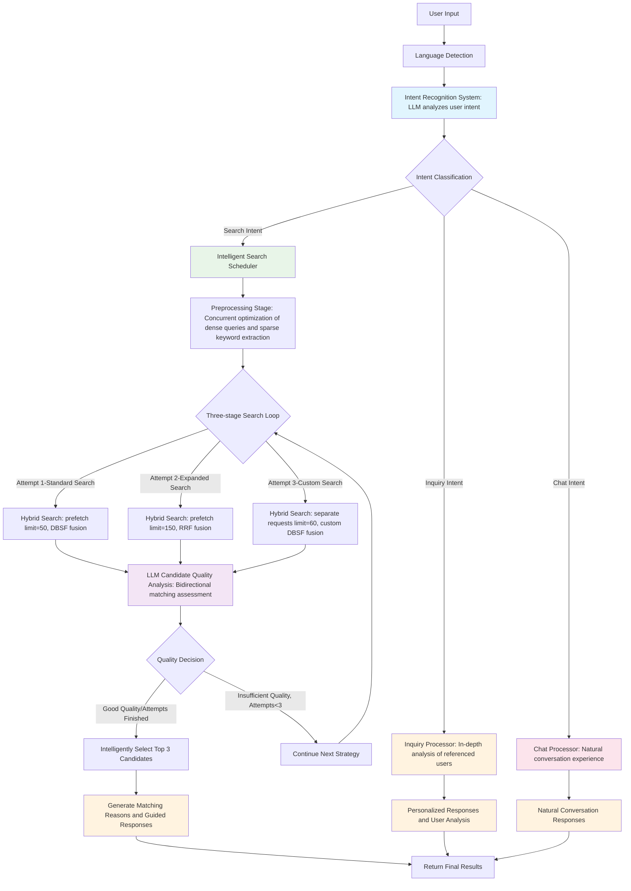
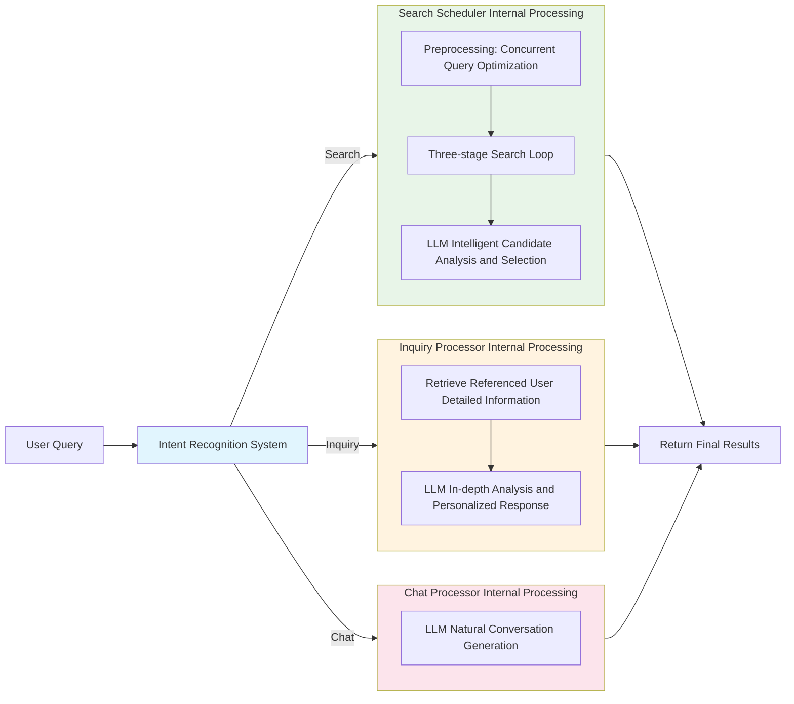

# User Search Agent Design Document

## 1. Overview

This design document details the architecture and implementation method of an intelligent dialogue and search system that can understand various user intents and provide corresponding services. The system not only supports traditional search requests (such as "help me find a Python project manager in Shenzhen"), but also handles inquiries about specific users and general chat. The system adopts an LLM-driven intent recognition + intelligent dispatch architecture, integrating multi-stage processing workflows, hybrid embedding search mechanisms, asynchronous execution optimization, and adaptive interaction strategies to ensure accuracy, relevance, and response speed of user experience.

### 1.0 Core Functional Features

**Intelligent Intent Recognition**:

- LLM-driven user intent analysis, automatically identifying three core needs: search, inquiry, and chat
- Support for composite scenario handling with user references to specific user information
- Context understanding based on user input content and reference information
- Intelligent routing to corresponding processors to ensure optimal user experience

**Multi-mode Interaction Processing**:

- **Search Mode**: Launch complete intelligent search workflow, return matching user list
- **Inquiry Mode**: Provide detailed information and question answering for specific users (referenced users)
- **Chat Mode**: Provide natural dialogue experience, support general communication and consultation

**Context-aware Processing**:

- Retrieve complete current user information as conversation context
- Support in-depth understanding and analysis of referenced user information
- Personalized response generation considering user background and needs

### 1.1 Core Architecture Features

**Intelligent Intent Recognition and Routing**:

- LLM-driven three-tier intent classification: search, inquiry, chat
- Intelligent context analysis based on user input text and referenced user information
- Automatic routing to specialized processors ensuring targeted optimal experience
- Support for composite scenarios: complex intent parsing with user reference + text input

**Hybrid Embedding and Search Mechanism** (Search Mode):

- Combined retrieval using Dense Vectors and Sparse Vectors
- Dense vectors capture semantic similarity, sparse vectors handle precise keyword matching
- Use payload filtering for structured field exact filtering (currently only used to exclude viewed user IDs)
- Fixed output of top 10 user information per search

**Intelligent Scheduling System** (Search Mode):

- Automatic result quality analysis and search strategy adjustment
- 3-tier progressive expansion strategy when results are insufficient
- First attempt: prefetch with both vector types limit=50, using DBSF fusion
- Second attempt: prefetch with both vector types limit=150, using RRF fusion
- Third attempt: separate dense and sparse search requests (limit=60), manual custom DBSF fusion (alpha=0.2)
- Clear failure handling and user feedback mechanism

**Asynchronous Execution Optimization**:

- Concurrent execution of independent components, 40-67% response time improvement
- Intelligent task scheduling and resource management
- Pipeline processing for overall throughput enhancement

**Enhanced Retrieval Accuracy** (Search Mode):

- Avoid structural information loss caused by pure text embedding
- Support fuzzy tag matching (e.g., "py" matches "Python") through SPLADE model
- Combination of structured data exact filtering and semantic search
- 15-30% improvement in recall rate, 2-5x improvement in search speed

### 1.2 Technical Optimization Focus

1. **Intelligent Intent Recognition Architecture**: LLM-driven user intent understanding, automatically distinguishing search needs, specific inquiries, and general chat, achieving precise functional routing and personalized interactive experience.
2. **Hybrid Embedding Architecture** (Search Mode): Integrated dual retrieval mechanism combining dense vectors (semantic understanding) and sparse vectors (keyword matching), combined with payload structured filtering, replacing traditional pure vector search + post-processing fuzzy matching patterns.
3. **Intelligent Fuzzy Matching Optimization** (Search Mode): SPLADE neural network automatically learns vocabulary expansion (e.g., "py" matches "Python"), significantly reducing computational overhead of local fuzzy matching.
4. **Keyword Extraction and Sparse Search** (Search Mode): Keyword extraction specifically for sparse vector search, without weight allocation.
5. **Filter Screening Mechanism** (Search Mode): Only used to exclude viewed user IDs, dynamically constructing filter objects during hybrid search.
6. **Intelligent Search Scheduling** (Search Mode): Automatically select search strategies (standard, expanded, custom) based on result quality and quantity, integrating adaptive adjustment of hybrid search.
7. **Three-stage Asynchronous Optimization and Unified Prompt Strategy**: First round fully concurrent execution of independent components, intermediate processing uniformly uses prompts (LLM can handle mixed Chinese-English input), language detection results used for final result generation.
8. **Context-aware Conversation** (Inquiry/Chat Mode): Combining current user information and referenced user information, providing personalized responses and suggestions, supporting deep user understanding and relationship analysis.

## 2. Overall Workflow

### 2.1 Intelligent Interaction and Search Scheduling Architecture



### 2.2 Simplified Execution Flow



### 2.3 Process Details

#### Main Execution Flow

1. **System Entry** (`intelligent_conversation`):

   - Language detection: Determine input language for final result generation
   - Retrieve current user information (if user_id provided), including demands and goals for context understanding
   - Initialize intent recognition system
2. **Intent Recognition Phase**:

   - LLM analyzes user input text and referenced user information (if any)
   - Three-tier classification: search, inquiry, chat
   - Route to corresponding processor based on intent result
3. **Search Mode Processing** (when intent is search):

   - **Preprocessing Stage**: Concurrent execution of dense vector query optimization and sparse keyword extraction
   - **Three-stage Search Loop**:
     - **Attempt 1**: Standard search (standard strategy)
     - **Attempt 2**: Expanded search (expanded strategy)
     - **Attempt 3**: Custom search (custom strategy)
     - Each call to `hybrid_search` function, filter only used to exclude viewed_user_ids
   - **Intelligent Candidate Analysis**: LLM analyzes search result quality and candidate matching (supports bidirectional matching)
   - **Intelligent Selection**: Select top 3 candidates that best meet user requirements
4. **Inquiry Mode Processing** (when intent is inquiry):

   - Retrieve detailed information of referenced users
   - Combine with current user information for context analysis
   - LLM generates targeted responses including user analysis, relationship suggestions, etc.
5. **Chat Mode Processing** (when intent is chat):

   - Provide personalized conversation experience based on current user information
   - LLM generates natural, friendly responses
   - Support general consultation and emotional communication
6. **Result Generation** (shared by all processors):

   - Receive output from each processor
   - Format final output according to language detection results
   - Return results in unified format

#### Key Features

- **Intelligent Candidate Selection**: LLM intelligently selects the top 3 candidates that best meet user needs (including bidirectional matching)
- **Three-stage Search Strategy**: standard → expanded → custom, gradually expanding search scope
- **Deep Demand Matching**: Bidirectional matching analysis based on users' real goals and demands
- **Viewed User Filtering**: Automatically exclude candidates already viewed by users to avoid duplicate recommendations

#### Architecture Advantages

- **Simplified Design**: Core functionality concentrated in intelligent search scheduler, avoiding duplicate implementation
- **Modular**: Clear component separation, easy to maintain and extend
- **Efficient Execution**: Direct hybrid search implementation calls, avoiding code duplication
- **Intelligent Decision Making**: LLM-driven candidate selection and search strategy adjustment

## 3. Key Component Design

### 3.0 Component Architecture Overview

The intelligent interaction and search system consists of the following **7 core components** with simplified architecture design:

#### Intent Recognition Component (1)

- **Intent Recognizer** (3.1): LLM-driven user intent analysis, automatically distinguishing between search, inquiry, and chat interaction modes
  - Intelligent context understanding: Analyze user input and referenced user information
  - Three-tier intent classification: search, inquiry, chat
  - Intelligent routing: Call corresponding processors based on intent results

#### Multi-mode Processors (3)

- **Intelligent Search Scheduler** (3.7): Core controller for search mode, responsible for search strategy selection, strict quality assessment and integrated analysis
  - Three-stage search strategy: standard → expanded → custom
  - Strict quality threshold: Candidate filtering based on PRIMARY REQUIREMENT
  - Integrated analysis process: Quality assessment, candidate selection, match reason generation and guided response integration
  - Bidirectional matching guarantee: Ensure truly mutually beneficial recommendations
- **Inquiry Processor** (3.8): In-depth analysis and personalized response generation for referenced users
- **Chat Processor** (3.9): Natural conversation experience and general consultation handling

#### Search Preprocessing Components (2)

- **Dense Vector Query Optimizer** (3.3): Understand user needs, generate clear character descriptions for semantic matching
- **Sparse Vector Keyword Extractor** (3.4): Extract precisely matched keywords for sparse search

#### Search Execution Component (1)

- **Hybrid Vector Search Engine** (3.5): Dense + sparse vector + filter filtering hybrid retrieval, supporting three search strategies

#### Architecture Features

- **Intelligent Intent Recognition**: LLM-driven user intent understanding and intelligent routing
- **Multi-mode Interaction**: Specialized handling for search, inquiry, and chat modes
- **Strict Quality Threshold**: PRIMARY REQUIREMENT-driven candidate filtering mechanism
- **Method Integration Optimization**: Reduce LLM calls, improve response speed and consistency
- **Intelligent Scheduling**: Quality-driven candidate selection and search strategy
- **Hybrid Search**: Triple matching mechanism of dense + sparse vector + filter
- **Responsibility Separation**: Clear separation of intent recognition, mode processing, search execution, and result generation

### 3.1 Intent Recognizer

LLM-driven user intent analysis system responsible for understanding users' real needs and routing to corresponding processors.

#### Core Functions

- **Intent Classification**: Automatically distinguish between search, inquiry, and chat interaction modes
- **Context Understanding**: Analyze the relationship between user input text and referenced user information
- **Intelligent Routing**: Call corresponding processors based on intent analysis results

#### Intent Classification Standards

1. **Search Intent (search)**:

   - User expresses need to find or match people meeting specific criteria
   - Contains clear filtering conditions (skills, location, position, etc.)
   - Examples: "Help me find a Python engineer in Shenzhen", "Looking for project managers"
2. **Inquiry Intent (inquiry)**:

   - User asks questions about specific referenced users
   - Wants to learn detailed information, background, capabilities of a certain user
   - Examples: "How is this user's tech stack?", "Is he suitable for our project?"
3. **Chat Intent (chat)**:

   - General communication, consultation, or emotional expression
   - Does not involve specific user search or specific user inquiry
   - Examples: "Hello", "How's the weather today?", "Can you give me some advice?"

#### LLM Prompt Design

```python
async def analyze_user_intent(self, user_input: str, referenced_user: dict = None, current_user: dict = None) -> dict:
    """
    Analyze user intent and return classification results
  
    Args:
        user_input: User input text
        referenced_user: Referenced user information (if any)
        current_user: Current user information
  
    Returns:
        {
            "intent": "search|inquiry|chat",
            "confidence": 0.95,
            "reason": "Analysis reason",
            "context_summary": "Context summary"
        }
    """
  
    # Build analysis prompt
    prompt = f"""
You are a professional user intent analyzer. Please analyze the user's input content and determine the user's true intent.

Intent Classification:
1. search - Search intent: User wants to find people meeting specific criteria
2. inquiry - Inquiry intent: User wants to learn detailed information about specific users
3. chat - Chat intent: General communication, consultation or emotional expression

User input: "{user_input}"

{f"Referenced user info: {json.dumps(referenced_user, ensure_ascii=False)}" if referenced_user else "No referenced user"}

{f"Current user info: {json.dumps(current_user, ensure_ascii=False)}" if current_user else "No current user info"}

Please analyze and return JSON format result:
{{
    "intent": "intent_type",
    "confidence": confidence_score(0-1),
    "reason": "judgment_reason",
    "context_summary": "context_summary"
}}

Analysis points:
- If user expresses finding/matching needs with filtering conditions, classify as search
- If user asks specific questions about referenced users, classify as inquiry
- If it's general communication or consultation, classify as chat
- Consider the impact of context and reference information
"""

    response = await self.llm_client.get_response(prompt)
    return json.loads(response)
```

#### Decision Logic

```python
async def route_to_processor(intent_result: dict, user_input: str, 
                           referenced_user: dict = None, current_user: dict = None,
                           viewed_user_ids: list = None,
                           referenced_users: list = None):
    """
    Route to corresponding processor based on intent analysis results
  
    Parameters:
        intent_result: Intent analysis result
        user_input: User input
        referenced_user: Primary referenced user information (for intent recognition and inquiry)
        current_user: Current user information
        user_id: User ID
        viewed_user_ids: List of viewed user IDs
        referenced_users: Complete referenced user information list (for search)
    """
    intent = intent_result["intent"]
    confidence = intent_result["confidence"]
  
    # Low confidence handling strategy
    if confidence < 0.7:
        # Default route to chat processing method, provide friendly clarification
        return await process_chat(
            user_input, current_user, 
            clarification_needed=True,
            uncertainty_reason=intent_result.get("reason", "")
        )
  
    # High confidence routing
    if intent == "search":
        return await intelligent_search(
            user_query=user_input,
            current_user=current_user,
            referenced_users=referenced_users,
            viewed_user_ids=viewed_user_ids
        )
    elif intent == "inquiry":
        if not referenced_user:
            return {
                "error": "Inquiry mode requires referencing specific user information",
                "type": "missing_reference"
            }
        return await process_inquiry(
            user_input, referenced_user, current_user
        )
    elif intent == "chat":
        return await process_chat(
            user_input, current_user
        )
    else:
        # Fallback handling
        return await process_chat(
            user_input, current_user,
            clarification_needed=True,
            uncertainty_reason="Unable to recognize your intent, please redescribe your needs"
        )
```

### 3.2 Language Detector

Used to detect the language of user input and determine response language. Implemented using simple rules.

#### Pseudocode

```python
import re

def detect_language(self, text: str) -> Tuple[str, float]:
    """
    Detect text language
  
    Args:
        text: Input text
      
    Returns:
        (language_code, confidence)
    """
    # Simple Chinese character detection
    chinese_chars = len(re.findall(r'[\u4e00-\u9fff]', text))
    total_chars = len(text.strip())
  
    if total_chars == 0:
        return "zh", 0.5
  
    chinese_ratio = chinese_chars / total_chars
  
    # Adjust detection logic: if Chinese character ratio exceeds 20%, consider it Chinese
    if chinese_ratio > 0.2:
        return "zh", min(0.9, 0.5 + chinese_ratio)
    else:
        return "en", min(0.9, 0.5 + (1 - chinese_ratio))
```

### 3.3 Dense Vector Query Optimizer

Optimize query text for dense vector search, generating clear character descriptions based on real user payload structure.

#### Pseudocode

```python
def optimize_query_for_dense_vector(
    self, 
    text: str, 
    referenced_users: List[Dict] = None
) -> str:
    """
    Optimize query text for dense vector search
    Generate clear character descriptions based on real user payload structure
  
    Args:
        text: Original query text
        referenced_users: List of referenced users
      
    Returns:
        Optimized query text
    """
    self.stats["llm_calls"] += 1
  
    # Build referenced user information
    referenced_info = ""
    if referenced_users:
        referenced_info = "\n\nReferenced users (already shown to user):\n"
        for i, ref_user in enumerate(referenced_users, 1):
            referenced_info += f"Ref{i}. Complete profile: {json.dumps(ref_user, ensure_ascii=False, indent=2)}\n"

    system_prompt = """
    You are a search query optimizer. Your task is to understand what the user is looking for and create a better search description.

    Instructions:
    1. Read the user's search query and any referenced users carefully
    2. Understand what type of person they want to find
    3. Create a clear description for semantic matching

    If referenced users are provided, consider:
    - What patterns or similarities the user might be looking for
    - Whether they want similar or different types of people

    Use the same language as the user's query. Keep your response short and focused.
    """
  
    user_prompt = f"""
    User's search query: {text}
    User's referenced users:
    {referenced_info}
  
    Create a simple, optimized description:
    """
  
    try:
        optimized_query = self.glm_client.simple_chat(
            content=user_prompt,
            system_prompt=system_prompt,
            temperature=0.3,
            max_tokens=150
        )
        return optimized_query.strip()
    except Exception as e:
        print(f"Query optimization failed: {e}")
        return text  # Return original query as fallback
```

#### LLM Prompt

```
System: You are a search query optimizer. Your task is to understand what the user is looking for and create a better search description.

Instructions:
1. Read the user's search query and any referenced users carefully
2. Understand what type of person they want to find
3. Create a clear description for semantic matching

If referenced users are provided, consider:
- What patterns or similarities the user might be looking for
- Whether they want similar or different types of people

Use the same language as the user's query. Keep your response short and focused.

User: User's search query: {text}
User's referenced users: {referenced_info}

Create a simple, optimized description:
```

### 3.4 Sparse Vector Keyword Extractor

A keyword extraction component specifically for sparse vector search, extracting precise matching technical terms, position titles, company names, and other key information.

#### Design Philosophy

The sparse vector keyword extractor addresses the following issues:

1. **Precise Matching Requirements**: Extract skill tags, tool names, frameworks, and other exact matching keywords
2. **Structured Information Preservation**: Maintain job titles, company names, geographic locations, and other structured information
3. **Domain Vocabulary Recognition**: Identify industry-specific terms and professional vocabulary
4. **Multi-language Support**: Support keyword extraction for mixed Chinese and English content

#### Core Features

- **Professional Vocabulary Priority**: Technical skills, tools, framework names
- **Entity Information Extraction**: Companies, schools, geographic locations
- **Experience Level Recognition**: Senior, junior, expert, and other experience descriptions
- **Industry Terminology Support**: Professional terms and abbreviations across various fields

#### Pseudocode

```python
def extract_tags_for_sparse_search(
    self,
    user_query: str,
    referenced_users: List[Dict] = None
) -> str:
    """
    Extract keywords for sparse vector search
    Extract precise matching keywords based on real user payload structure
  
    Args:
        user_query: User query
        referenced_users: List of referenced users
      
    Returns:
        Keyword text for sparse search
    """
    self.stats["llm_calls"] += 1
  
    # Build referenced user information
    referenced_info = ""
    if referenced_users:
        referenced_info = "\n\nReferenced users (already shown to user):\n"
        for i, ref_user in enumerate(referenced_users, 1):
            referenced_info += f"Ref{i}. Complete profile: {json.dumps(ref_user, ensure_ascii=False, indent=2)}\n"

    system_prompt = """
    You are a keyword extraction specialist for search systems. Extract precise keywords and terms for sparse vector matching.

    Instructions:
    1. Extract specific technical skills, tools, frameworks, and technologies
    2. Include job titles, roles, and positions mentioned
    3. Extract company names, institutions, and organizations
    4. Include industry terms and domain-specific vocabulary
    5. Extract location names if relevant
    6. Include experience levels and qualifications

    Focus on exact terms that would appear in user profiles for precise matching.
    Use the same language as the user's query. Return keywords separated by spaces.
    """
  
    user_prompt = f"""
    User's search query: {user_query}
    User's referenced users:
    {referenced_info}
  
    Extract precise keywords for exact matching:
    """
  
    try:
        keywords = self.glm_client.simple_chat(
            content=user_prompt,
            system_prompt=system_prompt,
            temperature=0.1,
            max_tokens=150
        )
        return keywords.strip()
    except Exception as e:
        print(f"Keyword extraction failed: {e}")
        return user_query  # Return original query as fallback
```

#### LLM Prompt

```
System: You are a keyword extraction specialist for search systems. Extract precise keywords and terms for sparse vector matching.

Instructions:
1. Extract specific technical skills, tools, frameworks, and technologies
2. Include job titles, roles, and positions mentioned
3. Extract company names, institutions, and organizations
4. Include industry terms and domain-specific vocabulary
5. Extract location names if relevant
6. Include experience levels and qualifications

Focus on exact terms that would appear in user profiles for precise matching.
Use the same language as the user's query. Return keywords separated by spaces.

User: User's search query: {user_query}
User's referenced users: {referenced_info}

Extract precise keywords for exact matching:
```

#### Keyword Extraction Examples

**Input Query**: "Looking for Python development engineers in Beijing with machine learning experience"

**Extracted Keywords**: "Python development engineer machine learning Beijing ML AI TensorFlow scikit-learn pandas numpy"

**Input Query**: "Find a senior React developer in San Francisco with 5+ years experience"

**Extracted Keywords**: "React developer senior San Francisco JavaScript frontend TypeScript Node.js"

### 3.5 Hybrid Vector Search Engine

Execute hybrid vector search and obtain database details, supporting three search strategies.

#### Pseudocode

```python
async def hybrid_search(
    self,
    dense_query: str,
    sparse_query: str,
    search_strategy: str = "standard",
    limit: int = 10,
    viewed_user_ids: List[str] = None,
    fetch_db_details: bool = True
) -> List[Dict]:
    """
    Execute hybrid vector search and obtain database details
  
    Args:
        dense_query: Dense vector query text
        sparse_query: Sparse vector query text
        search_strategy: Search strategy ("standard", "expanded", "custom")
        limit: Number of results to return
        viewed_user_ids: List of viewed user IDs
        fetch_db_details: Whether to fetch detailed information from database
      
    Returns:
        List of search results (including database detailed information)
    """
    try:
        # Build basic filter (only for excluding viewed users)
        filter_obj = None
        if viewed_user_ids:
            filter_obj = models.Filter(
                must_not=[
                    models.FieldCondition(
                        key="user_id", 
                        match=models.MatchAny(any=viewed_user_ids)
                    )
                ]
            )
      
        # Execute vector search
        if search_strategy == "standard":
            vector_results = self._standard_search(dense_query, sparse_query, filter_obj, limit)
        elif search_strategy == "expanded":
            vector_results = self._expanded_search(dense_query, sparse_query, filter_obj, limit)
        elif search_strategy == "custom":
            vector_results = self._custom_search(dense_query, sparse_query, filter_obj, limit)
        else:
            raise ValueError(f"Unsupported search strategy: {search_strategy}")
      
        # If database details not needed or no search results, return vector search results directly
        if not fetch_db_details or not vector_results:
            return vector_results
      
        # Extract user ID list
        user_ids = [str(result.get("user_id")) for result in vector_results if result.get("user_id")]
      
        if not user_ids:
            return vector_results
      
        print(f"🔍 Vector search found {len(vector_results)} candidates, fetching database details...")
      
        # Fetch user detailed information from database
        db_details = await self._fetch_user_details_from_db(user_ids)
      
        # Merge vector search results and database details
        merged_results = self._merge_vector_and_db_results(vector_results, db_details)
      
        print(f"✅ Successfully obtained database details for {len([r for r in db_details.values() if not r.get('error')])} users")
      
        return merged_results
          
    except Exception as e:
        print(f"Hybrid search failed: {e}")
        return []
```

### 3.6 Intelligent Search Scheduler

Controls the entire search process, responsible for search strategy adjustment, result quality analysis, and intelligent candidate selection.

#### Design Considerations

The intelligent search scheduler addresses the following issues:

1. **Dynamic Search Strategy Adjustment**: Adaptively select different search strategies (standard, expanded, custom) based on query result quality
2. **Strict Quality Thresholds**: Use LLM to analyze all candidates, only provide recommendations when 3+ candidates meet PRIMARY REQUIREMENTS
3. **Integrated Analysis Process**: Integrate candidate quality assessment, match reason generation, and guidance response generation in a single method
4. **goal/demand Matching Integration**: Directly integrate user goal and demand analysis into the candidate selection process
5. **Bidirectional Matching Guarantee**: Ensure recommended candidates have genuine bidirectional compatibility with users

#### Core Quality Assessment Improvements

**Strict Candidate Thresholds**:

- **PRIMARY REQUIREMENT Filtering**: Candidates must simultaneously meet user requirements and reverse matching requirements
- **Quantity Check Mechanism**: When fewer than 3 qualified candidates are found, the system evaluates quality as "poor" and does not provide recommendations
- **Quality-Driven Decisions**: Only stop search iterations when sufficiently high-quality candidates are found

**Integrated Processing Flow**:

- The `analyze_candidates_quality` method now simultaneously handles:
  - Candidate quality assessment and grading
  - Intelligent candidate selection (TOP 3)
  - Match reason generation (natural language)
  - Guidance response generation (user-friendly)

#### Core Workflow

```python
async def intelligent_search(
    self,
    user_query: str,
    current_user: dict = None,
    referenced_users: List[Dict] = None,
    viewed_user_ids: List[str] = None
) -> Dict:
    """
    Complete intelligent search method - includes language detection, search scheduling and result generation
  
    Args:
        user_query: User query
        current_user: Complete information of current user (including demands and goals)
        referenced_users: List of referenced users
        viewed_user_ids: List of viewed user IDs
      
    Returns:
        Complete formatted search results
    """
    total_start_time = time.time()
    self.stats["search_count"] += 1
  
    # Initialize performance statistics
    performance_stats = {
        "language_detection": 0.0,
        "preprocessing": 0.0,
        "vector_searches": {},
        "candidate_analysis": {},
        "result_generation": 0.0,
        "total_time": 0.0
    }
  
    try:
        # Step 1: Language detection
        step_start = time.time()
        language_code, confidence = self.detect_language(user_query)
        performance_stats["language_detection"] = time.time() - step_start
        print(f"🌐 Detected language: {language_code} (confidence: {confidence:.2f}) - time: {performance_stats['language_detection']:.3f}s")
      
        # Step 2: Use passed current_user information
        current_user_info = current_user
        if current_user_info:
            print(f"✅ Using passed user information")
      
        # Step 3: Preprocessing phase - concurrent execution of independent components
        step_start = time.time()
        print("🔄 Starting preprocessing phase...")
      
        # Concurrent execution of preprocessing tasks
        tasks = [
            asyncio.create_task(self._async_optimize_dense_query(user_query, referenced_users)),
            asyncio.create_task(self._async_extract_sparse_tags(user_query, referenced_users))
        ]
      
        dense_query, sparse_query = await asyncio.gather(*tasks)
        performance_stats["preprocessing"] = time.time() - step_start
      
        print(f"✅ Preprocessing completed - Dense: {len(dense_query)}, Sparse: {len(sparse_query)} - Time: {performance_stats['preprocessing']:.3f}s")
      
        # Step 4: Three-phase search loop
        search_strategies = ["standard", "expanded", "custom"]
        all_candidates = []
        best_analysis = None
      
        for attempt, strategy in enumerate(search_strategies, 1):
            print(f"🔍 Search attempt {attempt}/3: {strategy} strategy")
          
            # Execute search
            search_start = time.time()
            candidates = await self.hybrid_search(
                dense_query=dense_query,
                sparse_query=sparse_query,
                search_strategy=strategy,
                limit=10,
                viewed_user_ids=viewed_user_ids or [],
                fetch_db_details=True
            )
            search_time = time.time() - search_start
            performance_stats["vector_searches"][f"attempt_{attempt}_{strategy}"] = search_time
          
            if candidates:
                all_candidates.extend(candidates)
              
                # LLM candidate quality analysis
                analysis_start = time.time()
                analysis = self.analyze_candidates_quality(
                    user_query=user_query,
                    candidates=candidates,
                    search_attempt=attempt,
                    current_user_info=current_user_info
                )
                analysis_time = time.time() - analysis_start
                performance_stats["candidate_analysis"][f"attempt_{attempt}"] = analysis_time
              
                print(f"📊 Analysis result: {analysis.get('overall_quality', 'unknown')} - {analysis.get('candidate_count', 0)} candidates")
                print(f"    Search time: {search_time:.3f}s, Analysis time: {analysis_time:.3f}s")
              
                # Stop search if quality is good or this is the last attempt
                if (analysis.get("overall_quality") in ["excellent", "good"] or 
                    not analysis.get("should_continue", True) or 
                    attempt == len(search_strategies)):
                    best_analysis = analysis
                    break
            else:
                print(f"    Search time: {search_time:.3f}s, no candidates")
          
            print(f"⏭️ Continue to next phase search...")
      
        # Step 5: Final result organization
        if not best_analysis:
            best_analysis = {
                "overall_quality": "poor",
                "candidate_count": 0,
                "selected_candidates": [],
                "analysis": "All search strategies failed to find suitable candidates"
            }
      
        # Step 6: Process analysis results
        step_start = time.time()
        selected_candidates = best_analysis.get("selected_candidates", [])
        intro_response = best_analysis.get("intro", "")
      
        # Since analyze_candidates_quality already includes match reasons, use results directly
        candidates_with_reasons = selected_candidates
      
        performance_stats["result_generation"] = time.time() - step_start
        print(f"🎯 Result generation completed - Time: {performance_stats['result_generation']:.3f}s")
      
        # Calculate search statistics
        end_time = time.time()
        search_time = end_time - total_start_time
        performance_stats["total_time"] = search_time
        self.stats["total_search_time"] += search_time
      
        # Print performance statistics summary
        print(f"\n📈 Performance Statistics Summary:")
        print(f"  Language detection: {performance_stats['language_detection']:.3f}s")
        print(f"  Preprocessing phase: {performance_stats['preprocessing']:.3f}s")
        for search_key, search_time in performance_stats['vector_searches'].items():
            print(f"  Vector search {search_key}: {search_time:.3f}s")
        for analysis_key, analysis_time in performance_stats['candidate_analysis'].items():
            print(f"  Candidate analysis {analysis_key}: {analysis_time:.3f}s")
        print(f"  Result generation: {performance_stats['result_generation']:.3f}s")
        print(f"  Total time: {performance_stats['total_time']:.3f}s")
      
        # Build final result
        result = {
            "status": "success",
            "search_time": search_time,
            "query": user_query,
            "candidates": candidates_with_reasons,
            "intro_message": intro_response,
            "language": language_code,
            "candidate_count": len(candidates_with_reasons),
            "total_candidates_found": len(all_candidates),
            "search_quality": best_analysis.get("overall_quality", "unknown"),
            "analysis": best_analysis.get("analysis", ""),
            "search_attempts": attempt,
            "performance_stats": performance_stats,  # Add performance statistics
            "stats": self.get_search_stats()
        }
      
        print(f"✅ Search completed: Found {len(result['candidates'])} recommended candidates")
        return result
      
    except Exception as e:
        performance_stats["total_time"] = time.time() - total_start_time
        print(f"❌ Search failed: {e}")
        return {
            "status": "error",
            "error": str(e),
            "query": user_query,
            "candidates": [],
            "search_time": time.time() - total_start_time,
            "performance_stats": performance_stats
        }
```

#### Candidate Quality Analysis Function

```python
def analyze_candidates_quality(
    self,
    user_query: str,
    candidates: List[Dict],
    search_attempt: int = 1,
    current_user_info: Dict = None,
    language_code: str = "zh",
    referenced_users: List[Dict] = None,
    total_found: int = 0
) -> Dict:
    """
    Use LLM to analyze candidate quality and matching degree (support bidirectional matching), 
    and generate match reasons and guidance responses
    Based on real users_rawjson payload structure
  
    Args:
        user_query: User query
        candidates: Candidate list
        search_attempt: Search attempt count
        current_user_info: Current user's complete information (including demands and goals)
        language_code: Language code
        referenced_users: Referenced user list
        total_found: Total found candidates count
      
    Returns:
        Analysis result, including quality assessment, candidate details (with match reasons) and guidance response
    """
    self.stats["llm_calls"] += 1
  
    if not candidates:
        # Determine reasons for poor search quality and generate corresponding guidance response
        poor_quality_intro = ""
        if language_code == "zh":
            if len(user_query.strip()) < 10:
                poor_quality_intro = "Your search requirements are too brief. Please provide more detailed conditions such as skill requirements, experience level, geographic location, etc."
            elif not current_user_info or current_user_info.get('error'):
                poor_quality_intro = "Your personal information is incomplete. Please improve your skills, demands, and goals information for more precise recommendations."
            else:
                poor_quality_intro = "No suitable candidates found. Suggest expanding search scope or adjusting search criteria."
      
        return {
            "overall_quality": "poor",
            "candidate_count": 0,
            "should_continue": True,
            "analysis": "No suitable candidates found, suggest expanding search scope",
            "intro": poor_quality_intro
        }

    system_prompt = """
    You are a professional candidate matching analyst with expertise in mutual compatibility assessment, match reasoning, and user guidance. Your task is to analyze candidate profiles using BIDIRECTIONAL MATCHING criteria, generate natural match reasons, and create engaging introductions.

    BIDIRECTIONAL MATCHING APPROACH:
    1. Read the user's search query carefully to understand what they are looking for
    2. If current user information is provided, analyze their demands and goals
    3. Examine each candidate's profile (skills, experience, background, goals, demands)
    4. Evaluate MUTUAL COMPATIBILITY using these criteria:

    CRITERIA 1 - CANDIDATES MEET USER NEEDS (One-way matching):
    - How well candidates match the user's search query requirements
    - How well candidates satisfy the current user's stated demands (semantic matching, not literal)
    - How well candidates align with the current user's goals (semantic matching, not literal)
  
    CRITERIA 2 - USER MEETS CANDIDATE NEEDS (Reverse matching):  
    - How well the current user satisfies each candidate's demands (semantic matching, not literal)
    - How well the current user aligns with each candidate's goals (semantic matching, not literal)
    - Consider the user's background, skills, and experience in relation to candidate needs

    SEMANTIC MATCHING PRINCIPLE:
    - Focus on meaning and intent rather than exact literal matches
    - Consider related skills, complementary experiences, and aligned interests
    - Value conceptual alignment over precise terminology matches

    QUALITY ASSESSMENT RULES:
    CRITICAL: If fewer than 3 candidates satisfy the PRIMARY REQUIREMENT, overall quality MUST be "poor"
  
    - poor: Fewer than 3 candidates meet PRIMARY REQUIREMENT - DO NOT include selected_candidates for poor quality
    - fair: Exactly 3 candidates meet PRIMARY REQUIREMENT with basic BIDIRECTIONAL compatibility (40-60% mutual match)
    - good: 3+ candidates meet PRIMARY REQUIREMENT with decent BIDIRECTIONAL compatibility (60-80% mutual match)  
    - excellent: 3+ candidates meet PRIMARY REQUIREMENT with strong BIDIRECTIONAL compatibility (>80% mutual match)
  
    SELECTION CRITERIA FOR TOP 3:
        STEP 1 - PRIMARY REQUIREMENT FILTERING (Must be satisfied for inclusion):
        - Strong match for user's query + user's demands + user's goals (at least one requirement)
        - Strong potential for user to satisfy candidate's demands + candidate's goals (at least one requirement)
      
        STEP 2 - COUNT CHECK:
        - If fewer than 3 candidates meet PRIMARY REQUIREMENT → quality = "poor", skip selection
        - If 3+ candidates meet PRIMARY REQUIREMENT → proceed to ranking
      
        STEP 3 - RANKING PRIORITY (Among candidates who meet primary requirements):
        1. **Query Match Priority**: Candidates who better satisfy the user's search query should be ranked higher
        2. **Comprehensive Match**: The more mutual needs satisfied, the better the ranking
        3. **Balance**: Consider both directions but prioritize query relevance in final ranking

    MATCH REASON GENERATION REQUIREMENTS:
    - Use natural, conversational language (avoid robotic "satisfies" descriptions)
    - Focus on candidate strengths and collaborative potential with specific details
    - Highlight query relevance first, then broader compatibility with concrete examples
    - {"使用中文" if language_code == "zh" else "Use English"}
    - Provide specific details about skills, experience, and background when available
    - Examples:
      * Chinese: "Python expert with 5 years of machine learning project experience, worked at ByteDance responsible for recommendation algorithm optimization, highly aligned with your AI technology direction"
      * English: "Senior frontend developer with 3+ years Vue.js experience at Google, led 5 major product launches, perfect technical and leadership match"

    INTRO MESSAGE REQUIREMENTS:
    - Professional and friendly tone
    - {"使用中文" if language_code == "zh" else "Use English"}
    - Briefly summarize key characteristics of found candidates
    - Encourage user to learn more about candidates
    - Keep under 200 characters
    - Examples:
      * Chinese: "Carefully selected 3 high-quality candidates for you: senior Python engineer, AI algorithm expert, product-tech hybrid talent, all from top internet companies with rich project experience. We recommend you learn more about their detailed backgrounds."
      * English: "Found 3 excellent candidates: Senior Python engineer, AI algorithm expert, and product-tech hybrid talent from top tech companies with rich project experience."

    JSON RESPONSE FORMAT:
    For quality "excellent", "good", or "fair":
    {
        "overall_quality": "quality_level",
        "candidate_count": candidate_count,
        "should_continue": boolean,
        "selected_candidates": [
            {
                "user_id": "candidate_id",
                "match_score": score_1_to_10,
                "key_strengths": ["list_of_relevant_strengths"],
                "match_reason": "natural_detailed_match_reason"
            }
        ],
        "analysis": "overall_bidirectional_analysis_and_recommendations",
        "intro": "friendly_professional_introduction_message"
    }

    For quality "poor":
    {
        "overall_quality": "poor",
        "candidate_count": candidate_count,
        "should_continue": boolean,
        "analysis": "analysis_of_poor_results",
        "intro": "explanation_of_poor_quality_with_suggestions"
    }
    """
   
  
    # Build candidate information based on real payload
    candidates_info = []
    for i, candidate in enumerate(candidates[:10], 1):  # Only analyze first 10
        candidates_info.append(f"Candidate{i}: {json.dumps(candidate, ensure_ascii=False, indent=2)}")
  
    # Build current user information
    current_user_section = ""
    if current_user_info and not current_user_info.get('error'):
        current_user_section = f"""
    Current User Profile (for bidirectional matching):
    {json.dumps(current_user_info, ensure_ascii=False, indent=2)}
  
    Please pay special attention to:
    - Current user's demands: {current_user_info.get('demands', [])}
    - Current user's goals: {current_user_info.get('goals', [])}
    - Current user's skills and background for reverse matching
    """
    else:
        current_user_section = """
    Current User Profile: Not available
    Note: Without current user information, focus primarily on how well candidates match the search query requirements.
    """
  
    user_content = f"""
    User search query: {user_query}
    Search attempt: {search_attempt}
  
    {current_user_section}
  
    Candidate profiles (JSON format):
    {chr(10).join(candidates_info)}
  
    Please analyze bidirectional compatibility and select the top 3 candidates with the best mutual fit.
    Focus on how candidates satisfy user needs AND how the user can satisfy candidate needs.
    Consider semantic matching rather than literal word matching for demands and goals.
    """
  
    try:
        result = self.glm_client.json_chat(
            content=user_content,
            system_prompt=system_prompt,
            temperature=0.2,
            max_tokens=1500
        )
      
        # Ensure selected candidates count does not exceed 3 and supplement complete candidate information
        if "selected_candidates" in result:
            result["selected_candidates"] = result["selected_candidates"][:3]  # Limit to first 3
            selected_candidates = []
            for sel in result["selected_candidates"]:
                # Find corresponding complete candidate information
                user_id = sel.get("user_id")
                full_candidate = next((c for c in candidates if str(c.get("user_id")) == str(user_id)), None)
                if full_candidate:
                    enhanced_candidate = full_candidate.copy()
                    enhanced_candidate.update(sel)
                    selected_candidates.append(enhanced_candidate)
                else:
                    selected_candidates.append(sel)
            result["selected_candidates"] = selected_candidates
      
        return result
  
    except Exception as e:
        print(f"LLM analysis failed: {e}")
        # Default fallback logic
        selected_candidates = candidates[:3] if candidates else []
        return {
            "overall_quality": "fair",
            "candidate_count": len(candidates),
            "should_continue": len(candidates) < 5,
            "selected_candidates": selected_candidates,
            "analysis": "LLM analysis failed, returning default result"
        }
```

#### Bidirectional Matching Mechanism Details

The bidirectional matching mechanism is the core innovation of the intelligent search system, breaking through the limitations of traditional unidirectional matching to achieve true mutually beneficial matching.

##### 3.7.1 Core Philosophy of Bidirectional Matching

Traditional search systems usually only consider "whether candidates meet user requirements," but this unidirectional matching has the following problems:

- **Information asymmetry**: Ignores candidates' needs and expectations
- **Low matching quality**: Situations where candidates appear suitable but are actually inappropriate
- **Poor user experience**: Recommended candidates may not be interested in the current user

The bidirectional matching mechanism solves the above problems through the following two dimensions:

**Dimension 1: Candidates Meet User Requirements (Forward Matching)**

```
User Requirements ← Candidate Capabilities
- Query Matching: Whether candidate skills and experience match search query
- Requirements Satisfaction: Whether candidates can meet user's specific demands
- Goal Alignment: Whether candidate capabilities help achieve user's goals
```

**Dimension 2: User Meets Candidate Requirements (Reverse Matching)**

```
Candidate Requirements ← User Capabilities  
- Skill Complementarity: Whether user background meets candidate's demands
- Goal Consistency: Whether user goals align with candidate's goals
- Value Provision: Whether user can bring expected value to candidates
```

##### 3.7.2 Semantic Matching Principles

Bidirectional matching uses semantic understanding rather than literal matching to ensure deep compatibility:

**Semantic Extension Examples**:

- User requirement: "Looking for AI expert" ↔ Candidate skills: "Machine learning, deep learning"
- Candidate goal: "Technical breakthrough" ↔ User capability: "R&D team, innovation projects"
- User demands: "Team collaboration" ↔ Candidate experience: "Project management, cross-departmental cooperation"

**Conceptual Association Matching**:

- Technology stack association: React ↔ Frontend development ↔ User interface design
- Industry experience: Finance ↔ Risk control ↔ Data analysis
- Career development: Technical expert ↔ Architect ↔ Technical leadership

##### 3.7.3 Matching Quality Assessment Standards

The system uses strict three-step quality assessment to ensure matching accuracy:

**Quality Assessment Core Rules**:

- **CRITICAL**: If fewer than 3 candidates meet PRIMARY REQUIREMENTS, overall quality must be assessed as "poor"

**Quality Level Definitions**:

- **poor**: Fewer than 3 candidates meet PRIMARY REQUIREMENTS - no candidate recommendations provided
- **fair**: Exactly 3 candidates meet PRIMARY REQUIREMENTS with basic bidirectional compatibility (40-60% complementary matching)
- **good**: 3+ candidates meet PRIMARY REQUIREMENTS with good bidirectional compatibility (60-80% complementary matching)
- **excellent**: 3+ candidates meet PRIMARY REQUIREMENTS with strong bidirectional compatibility (>80% complementary matching)

**PRIMARY REQUIREMENT Definition**:
Candidates must simultaneously meet both dimensions to be considered:

1. **User Requirement Satisfaction**: Strong match for user query + user demands + user goals (at least one requirement)
2. **Reverse Requirement Satisfaction**: User has strong potential to meet candidate demands + candidate goals (at least one requirement)

**Assessment Dimension Weights**:

```
Total Match Score = Query Match(40%) + Forward Match(30%) + Reverse Match(30%)

Query Match = Degree to which candidates meet search query
Forward Match = Degree to which candidates meet user requirements  
Reverse Match = Degree to which user meets candidate requirements
```

##### 3.7.4 Intelligent Candidate Selection Strategy

The system adopts a three-step candidate selection process:

**STEP 1 - PRIMARY REQUIREMENT Filtering**:

- Strictly screen candidates who meet PRIMARY REQUIREMENTS
- Ensure basic requirements for bidirectional compatibility
- Only candidates who pass this step can proceed to subsequent processes

**STEP 2 - Quantity Check and Quality Assessment**:

- If fewer than 3 candidates pass STEP 1 → Quality assessment as "poor", stop selection process, skip candidate recommendations
- If 3+ candidates pass STEP 1 → Proceed to STEP 3 for intelligent ranking

**STEP 3 - Intelligent Ranking and Selection**:

1. **Query Match Priority**: Candidates with highest search query match priority
2. **Comprehensive Match Consideration**: Among candidates with similar query matches, select those with better bidirectional compatibility
3. **Balance Strategy**: Consider bidirectional requirements but prioritize query relevance
4. **Complementarity Consideration**: Prioritize recommending pairings that can form positive interactions

**Real Case Example**:

```
User query: "Looking for Python development engineer"
User profile: { demands: ["technical cooperation"], goals: ["product development"] }

Candidate A: Python expert, demands: ["project opportunities"], goals: ["technical improvement"]
Candidate B: Java expert, demands: ["startup cooperation"], goals: ["product development"]  

Ranking result: A > B
Reason: A has higher query match and completely complementary bidirectional requirements
```

**Quality Assessment Strictness Explanation**:
Based on the latest implementation, the system adopts stricter quality assessment standards:

- Must have at least 3 candidates meeting PRIMARY REQUIREMENTS to assess as non-poor quality
- This ensures consistency and reliability of recommendation quality
- Avoids negative impact of low-quality matches on user experience
- In testing, this manifests as returning poor quality for extremely specialized queries, and good/excellent quality for regular queries

## Summary

This document redesigns the intelligent search scheduler based on code implementation, with major improvements including:

### Core Improvements

1. **Strict Quality Thresholds**: Introduce CRITICAL rules, quality must be "poor" when fewer than 3 candidates meet PRIMARY REQUIREMENTS
2. **Three-step Candidate Selection**: Strict process of PRIMARY REQUIREMENT filtering → quantity check → intelligent ranking
3. **Method Integration Optimization**: Integrate candidate quality assessment, match reason generation, and guidance response generation into a single `analyze_candidates_quality` method
4. **Bidirectional Matching Enhancement**: Ensure recommended candidates have genuine bidirectional compatibility, not unidirectional matching
5. **Integrated goal/demand Analysis**: Directly integrate user requirement analysis into the candidate selection process

### Workflow Optimization

1. **Pre-generation Phase**: One-time concurrent generation of dense queries and sparse keywords
2. **Three-phase Search Loop**: Gradual expansion from standard → expanded → custom strategies
3. **Strict Quality Assessment**: PRIMARY REQUIREMENT check after each search to ensure candidate thresholds
4. **Integrated Analysis Process**: Single method completes quality assessment, candidate selection, reason generation, and guidance response
5. **goal/demand Integration**: Consider user's deep requirements during candidate analysis process

### Technical Features and Improvements

- **Quality-driven Decisions**: Strict candidate thresholds based on CRITICAL rules ensure recommendation quality
- **Method Integration Optimization**: Reduce LLM call frequency, improve response speed and consistency
- **Bidirectional Matching Guarantee**: Ensure genuine mutually beneficial matching, not unidirectional adaptation
- **Use Qdrant API Standards**: Fusion mechanisms (DBSF, RRF) and custom fusion
- **Intelligent Fallback Strategy**: Ensure system stability and user experience
- **Complete Error Handling**: Response formatting and fault tolerance mechanisms

### 3.7 Inquiry Processing Methods

Specifically handle user inquiries about specific referenced users, providing in-depth analysis and personalized responses.

#### Core Features

- **User Information Retrieval**: Retrieve detailed information of referenced users from database
- **In-depth Analysis**: Comprehensive analysis based on user background, skills, and experience
- **Relationship Suggestions**: Provide cooperation suggestions combined with current user information
- **Personalized Responses**: Targeted answers to user's specific questions

#### LLM Prompt Design

```python
async def process_inquiry(self, user_input: str, referenced_user: dict, current_user: dict = None) -> dict:
    """
    Process user inquiry about specific user
  
    Args:
        user_input: User's inquiry content
        referenced_user: Information of the user being inquired about
        current_user: Current user information
  
    Returns:
        Formatted response result
    """
  
  
    prompt = f"""
You are a professional user analysis expert. Please provide detailed and accurate analysis and recommendations based on user information and inquiry content.

{f"Inquired user information：
{json.dumps(referenced_user, ensure_ascii=False, indent=2)}" if referenced_user else "No inquired user information"}

{f"Current user information：{json.dumps(current_user, ensure_ascii=False, indent=2)}" if current_user else "No current user information"}

User inquiry: "{user_input}"

Please provide detailed analysis and response, including:

1. **Direct Answer**: Direct answer to user questions
2. **User Analysis**: In-depth analysis of the inquired user's professional capabilities, experience, and characteristics
3. **Compatibility Assessment**: If current user information is available, assess compatibility with current user needs
4. **Collaboration Suggestions**: Provide specific collaboration suggestions based on analysis results
5. **Considerations**: Risks or suggestions that need attention

Response requirements:
- Professional, objective, and constructive
- Analyze based on facts, avoid subjective assumptions
- Provide specific suggestions and action guidance
- Natural and easy-to-understand language

Please respond in natural conversation format, do not use numbering or list format.
"""

    response = await self.llm_client.get_response(prompt)
  
    return {
        "type": "inquiry_response",
        "content": response,
        "referenced_user": referenced_user,
        "timestamp": datetime.now().isoformat()
    }
```

#### Special Features

1. **Skill Matching Analysis**: Analyze the matching degree between user skills and project requirements
2. **Experience Assessment**: Assess user's actual capabilities based on work experience
3. **Collaboration Potential Analysis**: Evaluate collaboration potential with current users
4. **Risk Identification**: Identify possible collaboration risks and considerations

### 3.8 Chat Processing Method

Provide natural conversational experience, handle general communication and consultation.

#### Core Functions

- **Natural Conversation**: Provide friendly, natural conversational experience
- **Context Understanding**: Provide personalized responses based on current user information
- **Intent Clarification**: Provide friendly clarification when user intent is unclear
- **Suggestion Provision**: Provide valuable suggestions and guidance to users

#### LLM Prompt Design

```python
async def process_chat(self, user_input: str, current_user: dict = None, 
                      clarification_needed: bool = False, 
                      uncertainty_reason: str = None) -> dict:
    """
    Process chat conversation
  
    Args:
        user_input: User input
        current_user: Current user information
        clarification_needed: Whether clarification of user intent is needed
        uncertainty_reason: Reason for unclear intent
  
    Returns:
        Chat response result
    """
  
    if clarification_needed:
        prompt = f"""
You are a friendly AI assistant.

{f"User's intent is not clear enough, please kindly guide the user to clarify their needs." if clarification_needed else ""}

User input: "{user_input}"

{f"Unclear reason: {uncertainty_reason}" if uncertainty_reason else ""}

{f"User background: {json.dumps(current_user, ensure_ascii=False, indent=2)}" if current_user else "No user information"}

Please provide a friendly response.

Response requirements:
- Friendly, warm tone
- Provide specific guidance options
- Avoid confusing the user
"""
    else:
        prompt = f"""
You are a friendly, professional AI assistant. Please provide helpful responses to users.

User input: "{user_input}"

{f"User background: {json.dumps(current_user, ensure_ascii=False, indent=2)}" if current_user else "No user information"}

Please provide natural, helpful responses. You can:
1. Answer user questions
2. Provide relevant suggestions
3. Engage in friendly communication

Response requirements:
- Natural, friendly conversational tone
- Provide valuable information or suggestions
- Consider user background information (if available)
"""

    response = await self.llm_client.get_response(prompt)
  
    return {
        "type": "chat_response",
        "content": response,
        "clarification": clarification_needed,
        "timestamp": datetime.now().isoformat()
    }
```

#### Special Features

1. **Intelligent Recommendation**: Recommend relevant functions based on user background
2. **Friendly Clarification**: Provide friendly clarification when intent is unclear
3. **Personalized Suggestions**: Provide targeted suggestions based on user information
4. **Emotional Support**: Provide warm, supportive communication experience

## 4. Main Process Implementation

Integrate all the above components into the main process to achieve intelligent intent recognition and multi-mode interaction processing.

### Core Implementation

```python
# Main entry: Intelligent interaction interface
async def intelligent_conversation(user_input, user_id=None, referenced_ids=None, viewed_user_ids=None):
    """
    Intelligent interaction unified entry point (integrates intent recognition and multi-mode processing)
  
    Parameters:
        user_input: User input text content
        user_id: User ID, used to get user's demands and goals information (optional)
        referenced_ids: Array of user IDs referenced by user, system will fetch complete user information from database (optional)
        viewed_user_ids: List of user IDs already viewed by user, used to exclude duplicate recommendations (optional)
  
    Returns:
        Interaction result: Intent-based personalized response, including result type tags
    """
    start_time = time.time()
  
    try:
        # Step 1: Language detection
        detected_language = detect_language(user_input)
      
        # Step 2: Get current user information (if user_id is provided)
        current_user = None
        if user_id:
            current_user = await _fetch_user_details_from_db(user_id)
      
        # Step 2b: Get referenced user information (if referenced_ids is provided)
        referenced_users = None
        if referenced_ids:
            referenced_users = await _fetch_user_details_from_db(referenced_ids)
      
        # Step 3: Intent recognition
        intent_result = await analyze_user_intent(
            user_input=user_input,
            referenced_user=referenced_users[0] if referenced_users else None,
            current_user=current_user
        )
      
        print(f"🎯 Intent recognition result: {intent_result['intent']} (confidence: {intent_result['confidence']:.2f})")
      
        # Step 4: Use route_to_processor to handle routing logic
        raw_result = await route_to_processor(
            intent_result=intent_result,
            user_input=user_input,
            referenced_user=referenced_users[0] if referenced_users else None,
            current_user=current_user,
            viewed_user_ids=viewed_user_ids,
            referenced_users=referenced_users
        )
      
        # Step 5: Unified result formatting
        final_result = {
            "status": "success",
            "intent": intent_result["intent"],
            "confidence": intent_result["confidence"],
            "language": detected_language,
            "result": raw_result,
            "processing_time": time.time() - start_time,
            "timestamp": datetime.now().isoformat()
        }
      
        print(f"✅ Interaction processing completed - Duration: {final_result['processing_time']:.3f}s")
        return final_result
      
    except Exception as e:
        error_result = {
            "status": "error",
            "message": f"Error occurred while processing request: {str(e)}",
            "intent": "unknown",
            "language": detected_language if 'detected_language' in locals() else "zh",
            "processing_time": time.time() - start_time,
            "timestamp": datetime.now().isoformat()
        }
        print(f"❌ Interaction processing failed: {str(e)}")
        return error_result
```

## 5. Conclusion

This design document elaborates in detail a completely new **Intelligent Interaction and Search System**, which not only has powerful search capabilities, but more importantly, can understand users' diverse needs and provide personalized interactive experiences.

### 5.1 Core Innovation Points

**1. Intelligent Intent Recognition Architecture**

- LLM-driven three-level intent classification (search, inquiry, chat)
- Context-aware intelligent routing mechanism
- Support for composite scenario intent parsing

**2. Multi-mode Interaction Processing**

- Search mode: Complete intelligent search process
- Inquiry mode: In-depth analysis for specific users
- Chat mode: Natural conversational experience

**3. Unified Interaction Entry Point**

- Single interface supports multiple interaction needs
- Intelligent context understanding and personalized responses
- Backward compatible with existing search functionality

### 5.2 Technical Advantages Summary

**Intent Understanding Capability**:

- **Intelligent Classification**: Automatically distinguish users' real needs (search/inquiry/chat)
- **Context Awareness**: Analyze combining referenced user information and current user background
- **Confidence Assessment**: Provide friendly clarification guidance when confidence is low
- **Robustness Processing**: Fallback mechanisms ensure system stability

**Search Mode Advantages** (maintaining all original advantages):

- **Hybrid Vector Architecture**: Dense vectors (semantic understanding) + Sparse vectors (keyword matching) + payload filtering (precise screening)
- **Intelligent Fuzzy Matching**: Sparse vectors built-in support for tag variants (e.g., "py" matches "Python"), recall rate improvement of 15-30%
- **LLM Intelligent Scheduling**: 3-level progressive expansion strategy, result quality-driven dynamic adjustment
- **Asynchronous Execution Optimization**: Concurrent execution of independent components, response time improvement of 40-67%

**Inquiry Mode Advantages**:

- **In-depth User Analysis**: Comprehensive assessment combining user background, skills, and experience
- **Personalized Suggestions**: Compatibility analysis based on current user needs
- **Relationship Insights**: Provide collaboration potential and risk identification
- **Professional Responses**: Targeted answers to users' specific questions

**Chat Mode Advantages**:

- **Natural Communication**: Friendly, warm conversational experience
- **Intelligent Recommendation**: Recommend relevant functions based on user background
- **Intent Clarification**: Friendly guidance when user needs are unclear
- **Emotional Support**: Provide supportive communication experience

### 5.3 System Performance

**Search Performance** (inheriting original advantages):

- **Hybrid Search Optimization**: 1.78s (hybrid search) vs 3.6s (pure vector) - **Performance improvement of 51%**
- **Intelligent Scheduling Scenarios**: 2.18s (standard) vs 4.13s (1 expansion) vs 6.88s (2 expansions)
- **Significant Reduction in Search Latency**: Hybrid search 180ms vs pure vector 350ms (48% improvement)

**Interaction Response Performance**:

- **Intent Recognition**: Average 200-300ms fast intent analysis
- **Inquiry Processing**: 500-800ms in-depth user analysis
- **Chat Response**: 300-500ms natural conversation generation

**System Scalability**:

- **Modular Design**: Each processor can be independently scaled
- **Unified Interface**: Simplifies client integration
- **Error Tolerance**: Comprehensive error handling and degradation mechanisms

### 5.4 Application Scenarios

**1. Talent Matching Platform**

- Search mode: Find candidates meeting criteria
- Inquiry mode: Deep understanding of specific candidates' capabilities and backgrounds
- Chat mode: Get recruitment advice and industry consultation

**2. Social Discovery Platform**

- Search mode: Discover like-minded users
- Inquiry mode: Learn detailed information about users of interest
- Chat mode: Daily communication and feature consultation

**3. Professional Network Platform**

- Search mode: Find professional collaborators
- Inquiry mode: Evaluate potential collaborators' professional capabilities
- Chat mode: Get career development advice

### 5.5 Deployment Recommendations

**Recommended Technology Stack**:

- **Vector Database**: Qdrant (native hybrid support, high performance)
- **LLM Service**: GLM-4 (excellent Chinese understanding, cost-effective)
- **Embedding Models**: BGE-M3 (dense vectors) + SPLADE-v3 (sparse vectors)
- **Storage Solution**: PostgreSQL (original data) + Qdrant (vectors + payload)

**Deployment Configuration**:

- **Memory Requirements**: Approximately 2-3GB (including vectors and models)
- **Computing Resources**: Multi-core CPU supporting asynchronous concurrency
- **Network Requirements**: Stable LLM API connection
- **Storage Space**: Vector storage increase of 5-25% (with compression optimization)

### 5.6 Summary

This intelligent interaction and search system successfully achieved an upgrade from single search functionality to a comprehensive intelligent interaction assistant by introducing LLM-driven intent recognition. The system not only maintains the high precision and high performance of the original search, but also adds personalized user understanding and multi-mode interaction capabilities, providing users with a more natural and intelligent experience.
